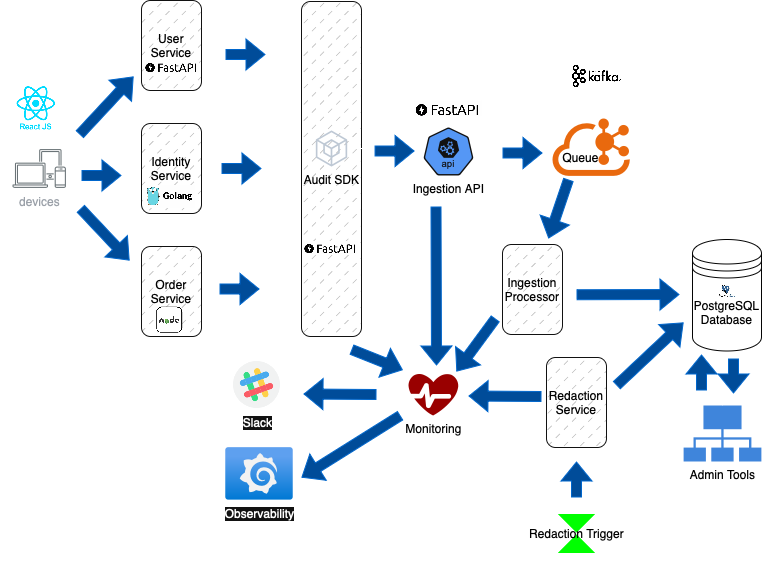
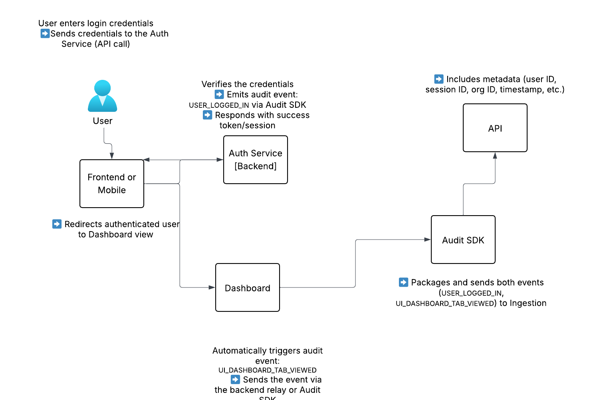
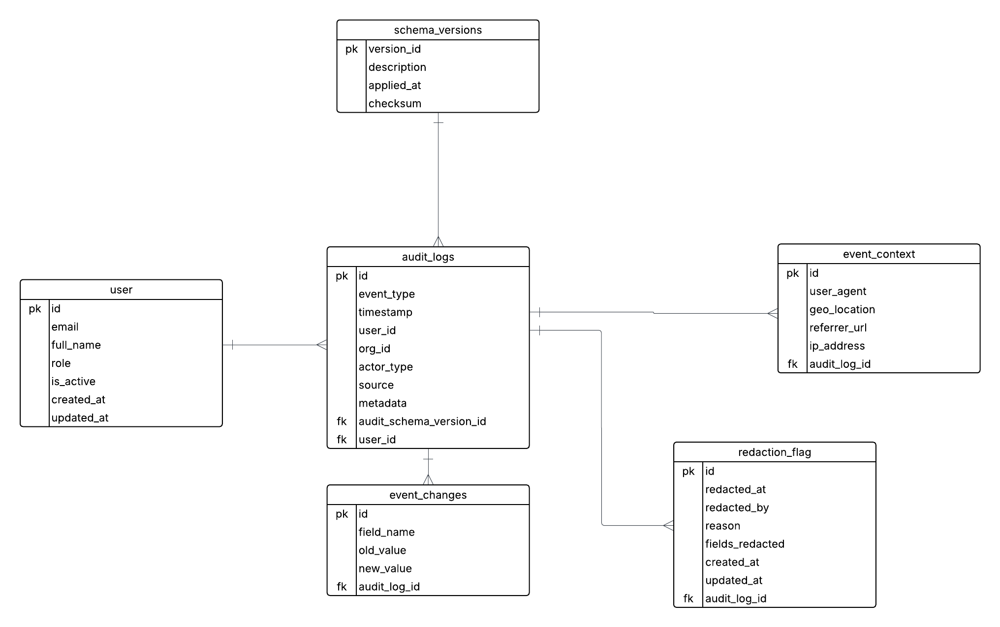
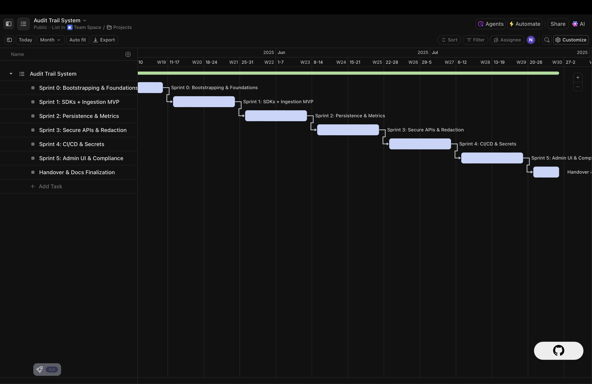

# Audit Trail System RFC

**👤 Author:** Nkenchor Osemeke  
**🏷️ Role:** Engineering Manager (Candidate)  
**📄 Submission Type:** Take-Home Technical Assessment  
**📌 Assessment Title:** Audit Trail System Design  
**📁 Repository:** [https://github.com/nkenchor/audit-trail-rfc](https://github.com/nkenchor/audit-trail-rfc)  
**📅 Date:** 1st May, 2025

---
## 📚 Table of Contents

### 1. Introduction and Business Context
- [1.1 Business Context](#11-business-context)
- [1.2 System Goals](#12-system-goals)
- [1.3 Design Principles](#13-design-principles)
- [1.4 System Maintainability and Velocity Objectives](#14-system-maintainability-and-velocity-objectives)

### 2. Architecture Overview
- [2.1 High-Level Architecture Overview](#21-high-level-architecture-overview)
- [2.2 Backend-Centric Audit Flow](#22-backend-centric-audit-flow)
- [2.3 Optional Frontend Event Capture Via Secure Relay](#23-optional-frontend-event-capture-via-secure-relay)
- [2.4 Event Propagation Path End-to-End Flow](#24-event-propagation-path-end-to-end-flow)
- [2.5 System Architecture Diagram](#25-system-architecture-diagram)
- [2.6 User Flow Diagram](#26-user-flow-diagram)

### 3. Event Capture and Logging Strategy
- [3.1 Canonical Audit Event Schema](#31-canonical-audit-event-schema)
- [3.2 Audit Event Generation via Shared SDK](#32-audit-event-generation-via-shared-sdk)
- [3.3 Backend vs Frontend Trust Boundaries](#33-backend-vs-frontend-trust-boundaries)
- [3.4 Handling Legacy or Unstructured Emitters](#34-handling-legacy-or-unstructured-emitters)
- [3.5 Metadata Enrichment: IP, User Agent, JWT Claims](#35-metadata-enrichment-ip-user-agent-jwt-claims)
- [3.6 Event Schema Versioning and Compatibility](#36-event-schema-versioning-and-compatibility)
- [3.7 Event Validation at Ingestion](#37-event-validation-at-ingestion)
- [3.8 Schema Evolution Policy: Forward/Backward Compatibility](#38-schema-evolution-policy-forwardbackward-compatibility)
- [3.9 Observability and Metrics](#39-observability-and-metrics)

### 4. Technology Choices and Infrastructure
- [4.1 Event Broker: Kafka vs RabbitMQ vs Kinesis](#41-event-broker-kafka-vs-rabbitmq-vs-kinesis)
- [4.2 Database: PostgreSQL vs MongoDB vs Elasticsearch](#42-database-postgresql-vs-mongodb-vs-elasticsearch)
- [4.3 Frameworks: FastAPI vs Express vs Go](#43-frameworks-fastapi-vs-express-vs-go)
- [4.4 Queue Processing and Idempotency Design](#44-queue-processing-and-idempotency-design)
- [4.5 Trade-offs and Final Recommendation](#45-trade-offs-and-final-recommendation)
- [4.6 CI/CD Toolchain Fit](#46-cicd-toolchain-fit)

### 5. Database and Storage Design
- [5.1 Storage Model Overview: SQL vs NoSQL Trade-offs](#51-storage-model-overview-sql-vs-nosql-trade-offs)
- [5.2 Canonical Schema for Audit Events](#52-canonical-schema-for-audit-events)
- [5.3 Time-Based Partitioning](#53-time-based-partitioning)
- [5.4 Indexing Strategy](#54-indexing-strategy)
- [5.5 TTL & Retention Policy for GDPR](#55-ttl--retention-policy-for-gdpr)
- [5.6 Query Optimization Considerations](#56-query-optimization-considerations)
- [5.7 CI/CD Testability](#57-cicd-testability)

### 6. Security, Privacy and Access Controls
- [6.1 Objectives](#61-objectives)
- [6.2 Secure Event Transmission](#62-secure-event-transmission)
- [6.3 Tamper Resistance](#63-tamper-resistance)
- [6.4 Access Controls and Permissions](#64-access-controls-and-permissions)
- [6.5 Redaction and Data Privacy](#65-redaction-and-data-privacy)
- [6.6 Logging, Monitoring, and Alerts](#66-logging-monitoring-and-alerts)
- [6.7 Compliance and Encryption](#67-compliance-and-encryption)
- [6.8 Security Test Coverage](#68-security-test-coverage)
- [6.9 Summary](#69-summary)
- [6.10 Secrets Management](#610-secrets-management)

### 7. Regulatory Compliance and GDPR
- [7.1 Data Minimization Principles](#71-data-minimization-principles)
- [7.2 Right to Access and Data Portability](#72-right-to-access-and-data-portability)
- [7.3 Right to Be Forgotten (Redaction)](#73-right-to-be-forgotten-redaction)
- [7.4 Logging Consent and Opt-Out Flows](#74-logging-consent-and-opt-out-flows)
- [7.5 Audit Log TTL and Purge Automation](#75-audit-log-ttl-and-purge-automation)
- [7.6 Multi-Tenancy, Anonymization, and Extended Compliance](#76-multi-tenancy-anonymization-and-extended-compliance)

### 8. Deployment and Rollback Strategy
- [8.1 Deployment Pipeline Overview](#81-deployment-pipeline-overview)
- [8.2 Blue-Green vs Canary Deployments](#82-blue-green-vs-canary-deployments)
- [8.3 Feature Flags for Audit Enablement](#83-feature-flags-for-audit-enablement)
- [8.4 Rollback Mechanism and Audit Failover](#84-rollback-mechanism-and-audit-failover)
- [8.5 Backup and Disaster Recovery Plan](#85-backup-and-disaster-recovery-plan)

### 9. Cost and Performance
- [9.1 Cost Breakdown: Detailed Estimates by Component](#91-cost-breakdown-detailed-estimates-by-component)
- [9.2 Read/Write Load Estimates and Query Patterns](#92-readwrite-load-estimates-and-query-patterns)
- [9.3 Cost Modeling Assumptions](#93-cost-modeling-assumptions)
- [9.4 Horizontal Scaling Model](#94-horizontal-scaling-model)
- [9.5 Optimization Recommendations](#95-optimization-recommendations)
- [9.6 Tenant-Level Cost Attribution (for SaaS Contexts)](#96-tenant-level-cost-attribution-for-saas-contexts)


### 10. Development and Delivery Plan
- [10.1 Delivery Assumptions and Team Composition](#101-delivery-assumptions-and-team-composition)
- [10.2 Story Point Estimation and Sprint Mapping](#102-story-point-estimation-and-sprint-mapping)
- [10.3 Milestone-Based Execution Timeline](#103-milestone-based-execution-timeline)
- [10.4 Visual Timeline and Roadmap](#104-visual-timeline-and-roadmap)
- [10.5 Risk, Dependencies, and Contingency](#105-risk-dependencies-and-contingency)
- [10.6 SDK Adoption and Onboarding Strategy](#106-sdk-adoption-and-onboarding-strategy)
- [10.7 Product Success Criteria](#107-product-success-criteria)
- [10.8 Delivery Governance and Reporting](#108-delivery-governance-and-reporting)

### 11. Future Roadmap
- [11.1 Real-Time Audit Dashboard](#111-real-time-audit-dashboard)
- [11.2 User Self-Audit Endpoint and Data Transparency](#112-user-self-audit-endpoint-and-data-transparency)
- [11.3 S3 or Glacier Archival Support](#113-s3-or-glacier-archival-support)
- [11.4 Integration with SIEM or SOC](#114-integration-with-siem-or-soc)
- [11.5 Role-Based Access for Audit Viewers](#115-role-based-access-for-audit-viewers)

---

## 1. Introduction and Business Context

### 1.1 Business Context

As the platform scales to support a growing and increasingly diverse user base, it becomes critical to implement a robust and centralized audit trail mechanism. The primary driver for this initiative is the need to ensure consistent visibility into user actions, particularly those involving sensitive or security-critical operations. Beyond operational transparency, the platform must adhere to compliance requirements imposed by regulations such as the General Data Protection Regulation (GDPR), SOC 2, and HIPAA.

Audit logs play a foundational role in maintaining system integrity, enabling accountability, and supporting post-incident investigations. Without a structured, tamper-resistant audit trail, the platform is exposed to a range of risks, including:

- Inability to trace the origin of security breaches or suspicious activity
- Insufficient evidence to enforce accountability among internal users
- Failure to comply with external audits and legal data access requests
- Lack of actionable telemetry for operations, product, and compliance teams

To address these issues, this RFC proposes the design of a scalable, extensible, and secure Audit Trail System. The system will serve as the system-of-record for high-value user interactions and system events across backend services and, optionally, frontend clients. It will ensure that logs are immutable, versioned, and queryable, while also offering the flexibility to support evolving product and compliance requirements.

---

### 1.2 System Goals

The Audit Trail System is designed to fulfill the following objectives:

1. **Event Capture:** Accurately capture high-value events from backend services such as authentication, data access, administrative changes, and sensitive updates.
2. **Structured and Versioned Logs:** Enforce a canonical event schema to maintain consistency across all producers. Include schema versioning to allow safe evolution over time.
3. **Immutable and Reliable Storage:** Persist audit logs in an append-only, tamper-resistant store (e.g., PostgreSQL with time-based partitioning and access control).
4. **Scalability:** Handle growing event volumes with performance guarantees, using distributed event queues and partitioned storage strategies.
5. **Compliance Readiness:** Support long-term retention, automated expiration, and redaction capabilities to align with GDPR, RTBF, and other regulatory frameworks.
6. **Internal Queryability:** Enable authorized internal teams to filter and analyze logs through time-based queries, user filters, and event types.
7. **Minimal Coupling:** Allow emitting services to log events via a shared SDK or message broker, reducing duplication and making adoption easy.
8. **Optional Frontend Logging:** Support UI-triggered audit events (e.g., downloads, modal access) through secure backend relay endpoints.
9. **Legacy System Compatibility:** Accommodate unstructured or legacy logs via ingestion pipelines that validate, normalize, and enrich events at the logging service level.

These goals form the foundation of the system architecture, technology selection, and implementation plan described in the following sections.


#### Non-Goals

While the Audit Trail System is designed to be comprehensive and flexible, it explicitly avoids the following:

- **Real-Time Alerting:** The system is not intended to provide real-time threat detection or alerting. It may serve as a data source for downstream systems that handle such use cases.
- **Transactional Logging:** The system does not aim to replace application-level or infrastructure logs (e.g., request traces, performance metrics) typically used for debugging or observability.
- **Authorization Enforcement:** The Audit Trail System will log actions but will not make authorization decisions or enforce access control policies on behalf of other systems.
- **User-Facing Analytics:** This system is not designed for direct consumption by end-users or customer-facing dashboards, though internal query APIs may feed such tools if required.
- **Ingestion of Non-Structured Logs:** Arbitrary log files or raw text inputs are out of scope unless routed through normalization pipelines that conform to the defined schema.

---

### 1.3 Design Philosophy

The design of the Audit Trail System is grounded in simplicity, modularity, and resilience. We aim to build a system that is easy to adopt, straightforward to extend, and reliable in production. To achieve this:

- **Favor convention over configuration:** Reduce friction for teams integrating audit capabilities by using sensible defaults and a consistent schema.
- **Optimize for observability:** Ensure auditing can be monitored, debugged, and improved with clear logging, metrics, and alerting hooks.
- **Design for scale and change:** Anticipate future use cases such as multi-tenancy, advanced analytics, real-time alerting, and customizable retention policies.

These design principles complement the system goals and serve as a compass for architectural decisions.

---

### 1.4 System Maintainability and Velocity Objectives

In addition to fulfilling business and compliance needs, the system must promote long-term maintainability and empower teams to move quickly without compromising stability or audit integrity. Architectural decisions prioritize modularity, developer autonomy, and safe, scalable evolution.

#### Maintainability

- **Schema-First Design:** All events conform to strict schemas (e.g., Pydantic, JSON Schema) that enable contract-first development and ensure consistency across services.
- **Schema Evolution Safety:** Versioning and validation pipelines ensure producers can evolve event structures independently without breaking consumers.
- **Modular Architecture:** Each system component (SDK, ingestion, persistence, querying) is independently deployable and fault-isolated to reduce blast radius and support iterative improvements.
- **Declarative Infrastructure:** Infrastructure is defined via Terraform and Helm, enabling reproducible, auditable deployments across environments.
- **Minimal Operational Overhead:** The system includes observability hooks, alerting for ingestion failures or lag, and self-healing mechanisms where feasible.

#### Velocity

- **Developer Ergonomics:** Frameworks like FastAPI provide built-in OpenAPI documentation, schema validation, and async support—minimizing boilerplate and easing adoption.
- **SDK-Driven Instrumentation:** Lightweight, well-documented SDKs abstract event formatting, publishing, and versioning—reducing cognitive load for developers.
- **CI/CD Safety Nets:** Linting, unit/integration tests, schema compliance checks, and query performance benchmarks are built into the pipeline to enable confident, high-velocity deployments.
- **Testability and Local Dev Experience:** Dockerized services and mock sinks simulate Kafka, PostgreSQL, and storage layers, allowing local testing and CI integration for developers.
- **Team Autonomy:** Clear boundaries around event production, validation, storage, and querying enable cross-team collaboration without central bottlenecks.

#### Extensibility

- **Pluggable Producers:** New producers (e.g., services, CLI tools, frontend relays) can be integrated with minimal effort via the shared SDK.
- **Composable Consumers:** Query APIs, redaction workflows, and retention logic are modular and RBAC-governed, supporting future use cases like SIEM exports or compliance dashboards.
- **Non-Disruptive Integrations:** Future additions (e.g., anomaly detection, self-serve audit portals, third-party exports) can be implemented without modifying core ingestion or storage pipelines.

These qualities ensure that the Audit Trail System is not only adopted but trusted, extended, and evolved over time by teams across the organization.

---

## 2. Architecture Overview

### 2.1 High-Level Architecture Overview

The Audit Trail System is designed as a loosely coupled, event-driven logging pipeline. It captures structured audit events from distributed backend services and optionally from the frontend, processes them through a reliable message broker, and persists them to a tamper-resistant storage layer.

All audit events pass through a common ingestion interface, allowing the system to centralize validation, enrichment, and storage. This ensures that the structure and quality of logs are not dependent on individual emitting services.

The system is composed of the following core components:

- **Audit Event Producers**: Backend services such as Auth, User, and Billing Services emit structured audit logs after executing sensitive operations.
- **Frontend Clients (optional)**: UI components that emit supplemental user interaction logs (e.g. sensitive modal access) via a secure backend endpoint.
- **Audit Ingress API**: A centralized backend endpoint that receives audit events from internal services or authenticated frontend clients.
- **Message Broker**: Kafka (or equivalent) to buffer and distribute audit events asynchronously to consumers.
- **Audit Trail Service**: A dedicated service that consumes events, applies schema validation and normalization, and persists the logs.
- **Audit Log Store**: PostgreSQL configured with time-based partitioning for scalable, queryable, and immutable storage.
- **Quarantine Queue (optional)**: Handles malformed or non-compliant logs, allowing them to be logged without polluting primary storage.

This architecture allows for asynchronous, fault-tolerant audit event processing at scale, with a clear separation of concerns between event emitters, transport, validation, and storage. By designing around a message broker and centralized consumer, we ensure consistency, observability, and extensibility.

---

### 2.2 Backend-Centric Audit Flow

Backend services are the primary and most trusted emitters of audit events. They use a shared SDK to emit well-structured logs immediately after performing business-critical actions, such as login attempts, profile changes, or permission updates.

These logs are pushed to Kafka asynchronously, decoupling the business logic from audit persistence and ensuring minimal latency impact on the primary operation.

---

### 2.3 Optional Frontend Event Capture (Via Secure Relay)

To support observability for user interactions that do not invoke backend APIs directly, frontend clients may emit audit events to a secure backend endpoint (`/api/audit/event`). This is optional and treated as lower trust.

When a frontend event is submitted:
1. The backend authenticates the session (e.g. JWT)
2. Enriches the event with additional trusted metadata:
   - User ID
   - IP address
   - Timestamp
   - User agent
3. Publishes the enriched event to Kafka for ingestion into the standard audit pipeline.

This ensures all frontend events are subject to the same validation, formatting, and persistence rules as backend events, while preserving security boundaries.

---

### 2.4 Event Propagation Path (End-to-End Flow)

1. **User Action Initiated** (e.g. profile update, tab click)
2. **Service Handles Action** (backend or frontend with backend relay)
3. **Audit Event Constructed** using SDK or relay POST
4. **Event Published** to Kafka (or equivalent broker)
5. **Audit Trail Service Consumes** the event asynchronously
6. **Event Validated and Normalized**
7. **Log Persisted** to partitioned PostgreSQL audit store
8. **(Optional)** Malformed logs sent to quarantine for review

**Example Scenario:**
- A user updates their profile picture through the frontend.
- The request is handled by the User Service backend.
- Upon success, the backend emits a `USER_PROFILE_UPDATED` event via the audit SDK.
- Simultaneously, the frontend emits a `UI_PROFILE_TAB_VIEWED` event to the relay endpoint.
- Both events are independently published to Kafka, enriched, validated, and stored.

---

### 2.5 System Architecture Diagram



The diagram illustrates the full audit trail system flow, broken down by roles and tools:

#### Flow Overview:
1. **Frontend (React.js) or Devices**  
   - Users interact with web/mobile apps.
   - These apps send API requests to backend services like **User**, **Order**, and **Identity Service**.

2. **Backend Services**  
   - Built with various technologies (e.g., **FastAPI**, **Golang**, **Node.js**).
   - Emit structured audit events via the **Audit SDK** (Python, Node.js, Go).

3. **Audit SDK**  
   - Embeds into services.
   - Automatically packages metadata (user ID, IP, org ID, etc.) and sends events via **HTTP** to the **Ingestion API**.
   - Supports FastAPI and REST standards.

4. **Ingestion API (FastAPI)**  
   - Receives audit events from SDK.
   - Validates schemas using tools like `validate_event_schema.py`.
   - Publishes valid events to a message broker (e.g., **Kafka**, **RabbitMQ**, **AWS SQS**).

5. **Message Queue (Kafka in this diagram)**  
   - Buffers and decouples ingestion from processing.
   - Ensures resilience and scalability.

6. **Ingestion Processor (Worker Service)**  
   - Pulls events from Kafka.
   - Enriches events (timestamps, user/org ID lookup).
   - Applies schema versioning (managed by `schema_versions.sql`).
   - Writes structured entries into **PostgreSQL** (`audit_logs` table).

7. **Database (PostgreSQL)**  
   - Stores audit logs securely.
   - Enforces schema migrations (e.g., `001_initial_audit_log.sql`).
   - Supports queries and redaction flags.

8. **Admin Tools / Dashboard**  
   - Allow authorized personnel to query, export, or redact logs.

9. **Redaction Service (Optional)**  
   - Triggered by Right-To-Be-Forgotten (RTBF) requests.
   - Updates redacted fields in the DB (`redacted_log_sample.json`).
   - Can run as background worker or Lambda job.

10. **Monitoring and Observability**  
   - Logs sent to tools like **Grafana**, **Prometheus**, or **DataDog**.
   - **Slack** used for deployment notifications via `notify.sh` or CI hooks.
   - SDK fallback can emit logs to stdout or observability stream.

> This architecture ensures loosely coupled, observable, and scalable audit trails with redaction and governance support.


---

### 2.6 User Flow Diagram



The diagram illustrates a typical user journey and how user-triggered events are captured and relayed into the Audit Trail Service.

---

1. **User (Web or Mobile)**  
   - Begins interaction by entering login credentials.
   - Credentials are sent to the **Auth Service** via a frontend API call.

2. **Frontend (React.js or Mobile App)**  
   - Sends login API requests to the **Auth Service**.
   - After successful login, redirects the authenticated user to the **Dashboard**.
   - Upon landing on the dashboard, it triggers a `UI_DASHBOARD_TAB_VIEWED` event via backend relay or SDK.

3. **Auth Service (Backend)**  
   - Verifies credentials (email, password, etc.).
   - Emits a structured `USER_LOGGED_IN` audit event via the embedded **Audit SDK**.
   - Responds with session token and authentication status.

4. **Dashboard (Frontend Route)**  
   - Loads the main interface after login.
   - Automatically triggers an audit event: `UI_DASHBOARD_TAB_VIEWED`.

5. **Audit SDK (Backend-embedded or via Relay)**  
   - Receives `USER_LOGGED_IN` and `UI_DASHBOARD_TAB_VIEWED` events.
   - Packages the events with metadata (user ID, session ID, org ID, timestamp).
   - Sends the events securely over HTTP to the **Ingestion API**.

6. **Ingestion API (FastAPI)**  
   - Accepts the structured events from the SDK.
   - Validates them and forwards them to the queue or stream for processing.

> This flow captures both backend and frontend events for a complete user journey, from login to dashboard view, while preserving audit integrity and metadata context.


## 3. Event Capture and Logging Strategy

### 3.1 Canonical Audit Event Schema

To ensure consistency, reliability, and future extensibility, the Audit Trail System defines a strict canonical schema for all audit events. This schema must be adhered to by all event producers (backend services and frontend relays) and is versioned to allow controlled evolution.

#### Core Fields (Required)

| Field           | Type          | Description |
|----------------|---------------|-------------|
| `action`        | string        | Identifier for the event type (e.g. `USER_LOGGED_IN`, `ACCOUNT_PERMISSION_CHANGED`). Must match a controlled vocabulary defined in `docs/event-types.md`. |
| `user_id`       | string (UUID) | Authenticated user who triggered the event. |
| `timestamp`     | ISO 8601      | UTC timestamp when the event occurred. |
| `resource_type` | string        | Logical entity affected by the action (e.g. `User`, `Project`, `Invoice`). |
| `resource_id`   | string (UUID) | Identifier of the affected resource. |
| `ip_address`    | string        | Origin IP of the user or service. |
| `user_agent`    | string        | Device/browser string where applicable. |
| `metadata`      | JSON object   | Custom key-value pairs for extra context (e.g. field changes, operation results). |
| `schema_version`| string        | Version of the audit event schema used (e.g. `1.0`). |

This structure ensures both flexibility and consistency, allowing logs to be parsed, filtered, and analyzed reliably over time.

---

### 3.2 Audit Event Generation via Shared SDK

To simplify adoption and enforce schema compliance, internal services are expected to emit events through a shared Audit Logging SDK. The SDK is responsible for:

- Constructing structured events that conform to the canonical schema.
- Applying defaults (e.g. current timestamp, version).
- Validating required fields against the schema.
- Publishing events to the message broker (e.g. Kafka).

#### SDK Capabilities

- Language-specific versions (Node.js, Python, Go).
- Optional middleware hooks for Express, FastAPI, or Go HTTP handlers.
- Support for correlation IDs to trace request flow.
- Retry with exponential backoff on transient errors.
- Local development mode with console or file-based logging.

Kafka is preferred over RabbitMQ or Kinesis for its high throughput, log compaction support, and mature ecosystem for event streaming.

This promotes uniformity across services and reduces the risk of malformed or incomplete logs entering the system.

---

### 3.3 Backend vs Frontend: Trust Boundaries

The system assumes a zero-trust stance toward client-originated data. All backend-generated audit events are considered authoritative, while frontend-originated events are treated as optional and untrusted until validated.

#### Backend Events

- Initiated after sensitive operations in service logic.
- Enriched at the source (e.g. user ID from session, IP from request).
- Sent directly to Kafka via the SDK.

#### Frontend Events

- Emitted via `/api/audit/event` to a secure backend endpoint (built using FastAPI or Express).
- Must be authenticated (e.g. via JWT).
- Backend performs:
  - Schema validation.
  - Enrichment (IP address, user ID from token).
  - Forwarding to Kafka or other broker.

This boundary enforces consistent treatment of all audit logs, while preserving flexibility and future UI observability support.

---

### 3.4 Handling Legacy or Unstructured Emitters

Legacy systems may not support the shared SDK or structured event formats. To accommodate these systems, the Audit Trail Service includes a normalization and validation layer that accepts loosely structured logs and transforms them into the canonical format.

#### Strategy

1. **Ingestion Wrappers**
   - Lightweight services or adapters (implemented using preferred stack) receive legacy logs (via HTTP, syslog, flat JSON).
   - Normalize field names and structure.
   - Inject missing metadata (e.g. timestamps, IP addresses).
   - Publish structured logs to the main Kafka topic.

2. **Audit Trail Service Compatibility Layer**
   - Parses known legacy formats using field mapping.
   - Converts logs into schema-compliant audit events.
   - Flags invalid or unverifiable logs.

3. **Quarantine Queue**
   - Stores rejected or malformed events.
   - Alerts teams to misbehaving producers.
   - Allows for manual inspection or remediation.

This approach ensures that legacy systems can participate in auditing without compromising data quality or system reliability.

---

### 3.5 Metadata Enrichment (IP, User Agent, JWT Claims)

Audit logs are enriched with context to improve traceability, support root cause analysis, and enable compliance auditing. Enrichment occurs at the point of event creation or at the backend relay for frontend-originated logs.

#### Enrichment Fields

- `ip_address`: Extracted from `X-Forwarded-For`, `request.remote_addr`, or headers.
- `user_agent`: Extracted from `User-Agent` header.
- `user_id`: Resolved from token/session context.
- `correlation_id`: Used to trace events across microservices (optional).
- `request_hash`: SHA-256 of the request body (optional; used for detecting tampering or sensitive change tracking).

Enrichment is automated in the SDK and enforced during validation.

---

### 3.6 Event Schema Versioning and Compatibility

All audit events include a `schema_version` field to support forward compatibility and historical interpretation.

#### Versioning Policy

- Semantic versioning is used (`1.0`, `1.1`, etc.).
- Additive schema changes (e.g. new optional fields) are considered backward-compatible.
- Breaking changes (e.g. required field renaming) require a major version bump and compatibility shim in the Audit Trail Service.

Consumers of the audit logs (e.g., dashboards built on PostgreSQL or Elasticsearch) are expected to interpret logs based on schema version.

---

### 3.7 Event Validation at Ingestion

All audit events must be validated before persistence to ensure data quality and structural consistency.

#### Validation Locations

- **SDK level**: Prevents emitting bad logs from compliant services.
- **API Relay Level**: Applies validation to frontend-originated logs.
- **Audit Trail Service**: Final guardrail for all logs (including from legacy systems).

#### Validation Rules

- All required fields must be present.
- Field types must match schema definition.
- IP addresses and timestamps must be in valid formats.
- `metadata` must be a JSON object.
- `action` must match a known list of allowed values.

Logs that fail validation are routed to the quarantine queue and optionally logged to a secondary failure channel for inspection.

Validation schemas are implemented using Pydantic (Python), class-validator (Node.js), or Go structs with tag-based validation depending on the language of the emitting service for framework compatibility.

---

### 3.8 Schema Evolution Policy (Forward/Backward Compatibility)

To support evolving product needs and regulatory requirements, the audit schema is designed to evolve without breaking existing logs.

#### Evolution Rules

- Additive changes (new fields) are allowed at any time.
- Deprecation of fields must be accompanied by a fallback or migration plan.
- Major changes (e.g. type changes or required field removal) must:
  - Be versioned with a new `schema_version`.
  - Include migration documentation or transformation logic in the Audit Trail Service.
- All schema changes are logged in `docs/schema-changelog.md`.

Schema migration is designed to be forward-compatible with PostgreSQL JSONB fields and partitioning strategies.

---

### 3.9 Observability and Metrics

To support operational monitoring and alerting, the Audit Trail Service will expose standard metrics via Prometheus or equivalent open-source tooling.

#### Metrics Tracked

- Events received per second
- Events successfully stored per second
- Invalid events (validation errors)
- Events per action type
- Latency from emission to persistence
- Quarantine queue size

These metrics will be visualized in Grafana, with alert thresholds and dashboards preconfigured to detect anomalies, misbehaving producers, or dropped logs in near real time.

This observability layer ensures system health, compliance readiness, and accountability across engineering and product teams.

---

## 4. Technology Choices and Infrastructure

The Audit Trail System depends on a set of carefully selected technologies that balance performance, observability, scalability, and compliance. This section outlines key technology choices, compares alternatives, and explains why each tool was selected over others.

---

### 4.1 Event Broker: Kafka vs RabbitMQ vs Kinesis

Audit events are published asynchronously to a message broker, which acts as a buffer between producers (e.g., backend services) and the Audit Trail Service consumer. This decouples the ingestion pipeline and enables fault tolerance, retries, and replay.

#### Chosen Technology: Apache Kafka

Kafka provides high throughput, log compaction, strong durability guarantees, and replayable streams—making it ideal for append-only, time-sequenced audit events.

**Pros:**
- Distributed, fault-tolerant, horizontally scalable
- Persistent logs allow replay for reprocessing
- High throughput for large-scale event ingestion
- Strong ecosystem (e.g., Kafka Connect, Schema Registry)
- Native support for partitioning and message ordering

**Cons:**
- Operational complexity (requires Zookeeper or KRaft setup)
- Steeper learning curve for configuration and tuning

**Example Usage in the Audit System:**
- Backend services publish audit logs via shared SDK → Kafka topic (`audit.events`)
- Audit Trail Service consumes events from Kafka with offset tracking and retry on failure
- Optional quarantine topic (`audit.events.invalid`) for malformed events

#### Alternatives Considered

**RabbitMQ:**
- Pros: Lightweight, easy to operate, strong routing capabilities
- Cons: Not optimized for high-throughput log-style workloads, limited message retention

**AWS Kinesis:**
- Pros: Managed, scalable, integrates with AWS ecosystem
- Cons: Vendor lock-in, higher costs at scale, limited replay control

**Why Kafka?**

Kafka was selected because it provides strong delivery guarantees, durability, and stream replay out of the box, which are essential for a compliance-grade audit log system.

Kafka topics used for audit ingestion (e.g. `audit.events`) are protected using ACLs and authentication mechanisms. Producers and consumers must authenticate using mTLS or SASL credentials depending on the cluster setup.

---

### 4.2 Database: PostgreSQL vs MongoDB vs Elasticsearch

Refer to [Section 4](#4-database-design-and-schema) for in-depth analysis of the database trade-offs.

**Final Choice:** PostgreSQL with time-based partitioning and JSONB schema  
**Justification:** Strong consistency, queryability, schema flexibility, cost-effective, and compliance-ready  
_PostgreSQL also integrates well with CI pipelines and tools like pg_partman for partition lifecycle automation._

---

### 4.3 Framework: FastAPI vs Express.js vs Go

The Audit Ingress API and Audit Trail Service are both backend components responsible for receiving, validating, and storing events. These services must be fast, lightweight, and observable.

#### Chosen Framework: FastAPI (Python)

**Pros:**
- Asynchronous and performant (based on Starlette + Uvicorn)
- Built-in OpenAPI/Swagger docs generation
- Strong support for type safety with Pydantic
- Rapid development and readability for compliance-sensitive domains
- Easy Prometheus integration for metrics (used in [Section 3.9](#39-observability-and-metrics))

**Cons:**
- Slightly lower raw performance than Go or Node.js under extreme load
- Requires tuning to scale horizontally with multiple workers (Gunicorn + Uvicorn)


#### Alternatives Considered

**Go (Gin or Fiber):**
- High throughput and low memory footprint
- Steeper development learning curve
- Requires more boilerplate for validation, error handling

**Express.js:**
- Familiar to many engineers, quick to prototype
- Weaker typing, less performant under load
- Lacks first-class support for OpenAPI


FastAPI was also chosen for its strong **developer experience**, making onboarding easier and reducing boilerplate. This aligns with our system maintainability and velocity goals from [Section 1.4](#14-system-maintainability-objectives).


**Why FastAPI?**

FastAPI offers the best balance of speed, schema-first design, and developer ergonomics. It also aligns with our [Section 1.4](#14-system-maintainability-objectives) maintainability goals and enables validation of audit logs at the point of ingestion.  
Using Pydantic and OpenAPI guarantees that logs published via the shared SDK comply with the canonical schema ([Section 3.2](#32-audit-event-generation-via-shared-sdk)).


SDKs built for internal services enforce schema-first event construction, with validations powered by Pydantic models shared across the API and backend services. This ensures that audit logs emitted via SDKs conform to the canonical schema defined in [Section 3.1](#31-canonical-audit-event-schema) and validated in [Section 3.2](#32-audit-event-generation-via-shared-sdk).


---

### 4.4 Queue Processing and Idempotency Design

All audit events are processed exactly-once from Kafka by the Audit Trail Service. To achieve idempotency and prevent duplicate inserts:

- Events are keyed by UUID (`id`) as the primary key in PostgreSQL
- Consumers track Kafka offsets in a durable store (e.g., Kafka consumer group)
- Retry logic is designed to safely reprocess failed events without side effects

**Framework Support:**
- Kafka consumer libraries in Python support idempotent consumption and auto-commit
- Retry/backoff policies with circuit breakers can be implemented using `tenacity` or similar libraries

**Justification:**

Using UUID-based deduplication and Kafka's durable offset tracking ensures reliable and exactly-once delivery semantics critical for audit logs.

---

### 4.5 Trade-offs and Final Recommendation

| Layer                 | Technology        | Rationale                                        |
|----------------------|-------------------|--------------------------------------------------|
| Event Broker          | Kafka             | High-throughput, replayable, durable             |
| Database              | PostgreSQL        | ACID-compliant, partitioned, JSONB support       |
| API Framework         | FastAPI (Python)  | Async, schema-first, OpenAPI-ready               |
| Queue Consumer        | Kafka Consumer    | Durable, retry-safe, offset-tracked              |
| Partition Management  | pg_partman        | Automatic future partition creation              |
| Retention / Redaction | SQL Scripts       | Transparent, controlled, auditable               |

This stack balances speed, compliance, observability, and extensibility. While more lightweight solutions (e.g., RabbitMQ + MongoDB) were considered, they lacked durability, integrity, and replay features essential to a tamper-resistant audit trail.

---

### 4.6 CI/CD Toolchain Fit

The system is designed for automation and testability across all infrastructure layers:

- **Kafka + PostgreSQL** are deployed with readiness probes and alert hooks
- **FastAPI** services include:
  - Pydantic-based validation tests
  - Schema migration checks
  - Redaction logic verification
- **pg_partman** partition creation jobs are tested in CI
- **Query benchmarks** run against staging datasets using test suites and `EXPLAIN ANALYZE`
- **Prometheus/Grafana** are used to track:
  - Partition sizes
  - Event ingestion rate
  - Quarantine queue health
  - Redaction and retention job status

By integrating observability, validation, and performance testing into the delivery pipeline, we ensure compliance and maintain confidence in production-grade reliability.

### Observability Stack

Prometheus scrapes metrics exposed by FastAPI and the Kafka consumer services, including ingestion rate, partition lag, redaction job success, and quarantine queue health. These are visualized using Grafana dashboards, as introduced in [Section 3.9](#39-observability-and-metrics).


---

## 5. Database and Storage Design

| Decision Layer | Technology |
|----------------|------------|
| Database       | PostgreSQL |
| Partitioning   | Monthly Range |
| Indexing       | B-Tree, Functional Indexes |
| Schema Format  | JSONB + Structured Columns |
| Retention Mgmt | Partition drops + redaction |


### 5.1 Storage Model Overview (SQL vs NoSQL Trade-offs)

The choice of database for audit trail storage is critical. It affects query performance, long-term storage efficiency, schema evolution flexibility, compliance support, and data integrity guarantees.

After evaluating SQL and NoSQL options, this system opts for **PostgreSQL**, with JSONB columns and time-based partitioning, as the primary audit event store. This choice balances structure and flexibility while supporting high-volume ingestion and efficient querying.

_PostgreSQL can also scale horizontally using [Citus](https://www.citusdata.com/), a PostgreSQL extension that distributes data and queries across multiple nodes for high-throughput workloads._


#### SQL (PostgreSQL)

**Pros:**
- Strong consistency and ACID compliance
- Native support for time-based partitioning
- Mature ecosystem and operator familiarity
- JSONB allows semi-structured schema flexibility
- Built-in support for indexing, foreign keys, constraints
- Time-based partition pruning improves query performance
- Can be queried directly using SQL and integrates well with analytics tools (e.g., Superset, Metabase)

**Cons:**
- Slightly higher ingestion latency compared to NoSQL systems
- Requires disciplined schema evolution for backward compatibility

> **Why PostgreSQL over MongoDB or Elasticsearch?**  
> PostgreSQL offers hybrid modeling (structured + flexible JSONB), strong integrity guarantees, and is cost-effective to operate. MongoDB lacks strong consistency and is harder to enforce schema constraints across services. Elasticsearch is optimized for full-text search and log analytics, but not ideal as a source of truth or for compliance-grade audit trails due to its eventual consistency model and lack of strong transactional guarantees.

#### NoSQL (MongoDB, DynamoDB)

**Pros:**
- Schema-less, flexible for rapidly changing event shapes
- Scales horizontally with ease (especially DynamoDB)

**Cons:**
- Weak consistency (eventual by default)
- Schema validation is optional (e.g., MongoDB’s schema enforcement is not strict)
- Harder to perform relational or windowed time-based queries
- Riskier for compliance or security-sensitive logs

#### Log Search Systems (e.g., Elasticsearch, OpenSearch)

**Pros:**
- Excellent for full-text and fuzzy search
- Great tooling for dashboards (e.g., Kibana)

**Cons:**
- Not append-only by default
- More complex backup/restore
- Weaker data immutability guarantees
- More costly to operate at scale due to indexing overhead

#### Final Decision: PostgreSQL

PostgreSQL offers a sweet spot: compliance-grade durability, schema integrity, time-series optimizations, and strong indexing — while retaining the flexibility to adapt via JSONB fields and partitions. It can also scale horizontally using extensions like **Citus** or via read replicas and table partitioning strategies.
---

### 5.2 Canonical Schema for Audit Events

To store audit logs consistently, a normalized schema is defined, replacing the earlier flat `audit_events` table. This new schema supports:

- Immutable append-only writes
- High-throughput ingestion and partitioning
- Rich querying across user, action, and time dimensions
- Redaction tracking (RTBF compliance)
- Schema versioning and metadata enrichment

#### Primary Table: `audit_logs`

```sql
CREATE TABLE audit_logs (
    id UUID PRIMARY KEY DEFAULT gen_random_uuid(),
    event_type TEXT NOT NULL,
    timestamp TIMESTAMPTZ NOT NULL DEFAULT NOW(),
    user_id UUID NOT NULL,
    org_id UUID,
    actor_type TEXT,
    source TEXT,
    metadata JSONB,
    audit_schema_version_id TEXT NOT NULL,
    created_at TIMESTAMPTZ DEFAULT NOW(),
    updated_at TIMESTAMPTZ DEFAULT NOW()
);
```

#### Supporting Tables

**Users**

```sql
CREATE TABLE user (
    id UUID PRIMARY KEY,
    email TEXT NOT NULL,
    full_name TEXT,
    role TEXT,
    is_active BOOLEAN DEFAULT TRUE,
    created_at TIMESTAMPTZ DEFAULT NOW(),
    updated_at TIMESTAMPTZ DEFAULT NOW()
);
```

**Schema Versions**

```sql
CREATE TABLE schema_versions (
    version_id TEXT PRIMARY KEY,
    description TEXT,
    applied_at TIMESTAMPTZ,
    checksum TEXT
);
```

**Event Context**

```sql
CREATE TABLE event_context (
    id UUID PRIMARY KEY DEFAULT gen_random_uuid(),
    audit_log_id UUID REFERENCES audit_logs(id),
    user_agent TEXT,
    geo_location TEXT,
    referrer_url TEXT,
    ip_address INET
);
```

**Event Changes**

```sql
CREATE TABLE event_changes (
    id UUID PRIMARY KEY DEFAULT gen_random_uuid(),
    audit_log_id UUID REFERENCES audit_logs(id),
    field_name TEXT,
    old_value TEXT,
    new_value TEXT
);
```

**Redaction Flag**

```sql
CREATE TABLE redaction_flag (
    id UUID PRIMARY KEY DEFAULT gen_random_uuid(),
    audit_log_id UUID REFERENCES audit_logs(id),
    redacted_at TIMESTAMPTZ,
    redacted_by UUID,
    reason TEXT,
    fields_redacted TEXT[],
    created_at TIMESTAMPTZ DEFAULT NOW(),
    updated_at TIMESTAMPTZ DEFAULT NOW()
);
```

---

### 🔗 Entity Relationships Overview



#### 1. `audit_logs.audit_schema_version_id` → `schema_versions.version_id`
- **Type**: Many-to-One  
- **Purpose**: Tracks which schema version was used to validate the log.

#### 2. `audit_logs.user_id` → `user.id`
- **Type**: Many-to-One  
- **Purpose**: Associates the log entry with the initiating user.

#### 3. `event_context.audit_log_id` → `audit_logs.id`
- **Type**: One-to-One  
- **Purpose**: Captures metadata like IP, browser, and geo-location.

#### 4. `event_changes.audit_log_id` → `audit_logs.id`
- **Type**: Many-to-One  
- **Purpose**: Stores before/after values for modified fields.

#### 5. `redaction_flag.audit_log_id` → `audit_logs.id`
- **Type**: One-to-One  
- **Purpose**: Indicates RTBF/redacted logs and reasons.

---

### Summary Table

| Source Table     | Foreign Key Field           | Target Table       | Relationship   | Purpose                          |
|------------------|-----------------------------|--------------------|----------------|----------------------------------|
| `audit_logs`     | `audit_schema_version_id`   | `schema_versions`  | Many-to-One    | Version tracking for schema      |
| `audit_logs`     | `user_id`                   | `user`             | Many-to-One    | User activity tracking           |
| `event_context`  | `audit_log_id`              | `audit_logs`       | One-to-One     | Metadata/contextual logging      |
| `event_changes`  | `audit_log_id`              | `audit_logs`       | Many-to-One    | Field-level change history       |
| `redaction_flag` | `audit_log_id`              | `audit_logs`       | One-to-One     | Redaction tracking (RTBF/GDPR)   |

> This schema design enables robust audit logging, compliance enforcement, and schema evolution across services in a scalable and queryable form.

---


### 5.3 Time-Based Partitioning

Time-based partitioning is a critical strategy for ensuring that the audit log table remains performant as data volume grows over time. Since audit events are time-series in nature and append-only, partitioning by time provides several operational and performance benefits.

#### Why Partition by Time?

- Partitioning allows the database to prune irrelevant partitions during queries, reducing scan time.
- It enables efficient bulk deletions or archiving of old data to comply with data retention policies (e.g., GDPR, RTBF).
- It improves insert performance by narrowing write targets.
- It simplifies the management of hot and cold data.

#### Partitioning Strategy

The audit_events table is configured as a range-partitioned table using the timestamp column. The partition range granularity is monthly to balance the number of partitions and row distribution.

```sql
CREATE TABLE audit_events (
    id UUID PRIMARY KEY DEFAULT gen_random_uuid(),
    action TEXT NOT NULL,
    user_id UUID NOT NULL,
    resource_type TEXT NOT NULL,
    resource_id UUID NOT NULL,
    timestamp TIMESTAMPTZ NOT NULL DEFAULT NOW(),
    ip_address INET,
    user_agent TEXT,
    metadata JSONB,
    schema_version TEXT NOT NULL,
    created_at TIMESTAMPTZ DEFAULT NOW()
) PARTITION BY RANGE (timestamp);
```

#### Example Partition

```sql
CREATE TABLE audit_events_2025_05 PARTITION OF audit_events
    FOR VALUES FROM ('2025-05-01') TO ('2025-06-01');
```

To automate partition creation and ensure future-proof scalability, use tools like pg_partman, or implement a scheduled job that creates partitions in advance of each new month.

#### Partition Maintenance

- Create partitions ahead of time (e.g., one month in advance).
- Monitor partition sizes to avoid skewed data distribution.
- Drop or archive old partitions after their TTL expires.
- Use ANALYZE and VACUUM on individual partitions for maintenance.

#### Query Optimization via Partition Pruning

When queries include time filters, such as:

```sql
WHERE timestamp >= '2025-05-01' AND timestamp < '2025-06-01'
```

PostgreSQL will automatically prune partitions that do not match the filter criteria. This significantly improves read performance on large datasets by reducing the number of scanned rows.

Best Practice: Always use bounded timestamp filters in queries and reporting tools to take full advantage of partition pruning.

_Refer to [pg_partman](https://github.com/pgpartman/pg_partman) for PostgreSQL partition management._

_See `scripts/retention/partition_maintenance.sql` for a sample partition cleanup script._

---

### 5.4 Indexing Strategy

Efficient indexing is essential to ensure low-latency access to audit logs, especially as the volume of records grows over time. The audit trail system supports diverse query patterns such as filtering by user, action, timestamp, or affected resources. A well-designed indexing strategy must balance read performance, ingestion throughput, storage footprint, and maintenance cost.

This section outlines the recommended indexing practices for the audit_events table and its partitions.

#### Primary Index

Each audit event is uniquely identified by a UUID. The primary key ensures data integrity and supports direct lookups when necessary.

```sql
PRIMARY KEY (id)
```

#### Timestamp Index

Time-based filters are common in audit queries. While partitioning already supports pruning based on time ranges, a dedicated index on the timestamp column within each partition improves ordering and point-in-time queries.

```sql

CREATE INDEX idx_audit_timestamp ON audit_events_2025_05 (timestamp);

```

#### User ID Index

To support tracing a specific user's actions across time, an index on user_id is required.

CREATE INDEX idx_audit_user_id ON audit_events_2025_05 (user_id);

This enables queries such as:

```sql
SELECT * FROM audit_events_2025_05
WHERE user_id = 'abc123' AND timestamp >= '2025-05-01' AND timestamp < '2025-06-01';
```

#### Action Type Index

For filtering by action type (e.g., USER_LOGGED_IN, USER_PROFILE_UPDATED), use a single-column index on action.

```sql
CREATE INDEX idx_audit_action ON audit_events_2025_05 (action);
```

This supports use cases such as aggregating or alerting based on certain action types.

#### Composite Index (User and Timestamp)

If user-specific time-bounded queries are frequent, consider creating a composite index:

```sql
CREATE INDEX idx_audit_user_timestamp ON audit_events_2025_05 (user_id, timestamp);
```

This can improve performance for queries combining user ID and time ranges.

#### Resource Type Index (Optional)

For audit trails focused on specific resource types (e.g., Project, Invoice), add an index on resource_type:

```sql
CREATE INDEX idx_audit_resource_type ON audit_events_2025_05 (resource_type);
```

Use this only if resource-type filtering is a common and performance-sensitive query pattern.

#### JSONB Metadata Indexes (Optional)

If certain keys inside the metadata JSONB field are frequently queried, functional indexes can be created for those fields.

```sql
CREATE INDEX idx_audit_metadata_status ON audit_events_2025_05 ((metadata->>'status'));
```

Use JSONB indexes cautiously to avoid excessive index bloat and write amplification. Only index fields that are known to be accessed regularly in queries.

#### Index Maintenance Strategy

- Indexes must be created per partition. Automate this via migration scripts or use tools like pg_partman with hooks.
- Regularly monitor index usage with pg_stat_user_indexes to drop unused or redundant indexes.
- Reindex large partitions periodically if index bloat or fragmentation is detected.
- Run ANALYZE after bulk inserts to ensure query planner accuracy.

By combining partition pruning with targeted indexing, the system supports high ingestion rates and efficient querying across multiple dimensions without incurring unnecessary performance penalties.

---

### 5.5 TTL and Retention Policy (for GDPR)

Audit logs may contain personally identifiable information (PII) and other sensitive data. To comply with regulations such as the General Data Protection Regulation (GDPR), the system must enforce a clear retention policy for stored audit events. This includes defining a default Time-To-Live (TTL), automating data expiration, and supporting user-specific deletion requests under the Right to Be Forgotten (RTBF).

#### Retention Policy

- Default retention period: 12 months
- Extended retention (optional): Configurable per environment (e.g., 24 months for production, 6 months for staging)
- Retention enforcement method: Drop expired partitions or redact specific records
- RTBF support: Redaction of user-specific records upon legitimate request

#### Partition-Level TTL Enforcement

Because the `audit_events` table is partitioned by time, enforcing TTL becomes efficient. Expired data can be deleted by dropping entire partitions.

Example:

```sql
DROP TABLE IF EXISTS audit_events_2024_05;
```

A scheduled task (cron job or database job) should be configured to regularly identify and drop partitions older than the retention threshold.

#### Example Logic

- Current date: 2025-06-01  
- Retention period: 12 months  
- Action: Drop partitions where partition end date < 2024-06-01

---

### Redaction for Right to Be Forgotten (RTBF)

When users request the deletion of their data, complete partition deletion may not be applicable. Instead, individual records related to the user must be redacted.

#### Recommended Redaction Approach

- Nullify the `user_id` field
- Replace sensitive `metadata` content with redacted placeholders

#### Example

```sql
UPDATE audit_events_2025_05
SET user_id = NULL,
    metadata = '{"redacted": true}'
WHERE user_id = 'a1b2c3d4-e5f6-7890-1234-56789abcdef0';
```

Ensure this operation is logged and that redacted records remain immutable to maintain audit consistency without exposing user data.

---

### Configuration Options

Retention logic should be environment-aware and configurable.

#### Example Configuration Variables

- `AUDIT_LOG_RETENTION_DAYS=365`
- `AUDIT_LOG_ALLOW_USER_DELETION=true`

These values should be externalized (e.g., environment variables or a central configuration service) to avoid hardcoding logic.

---

### Monitoring and Alerts

Set up automated alerts for the following conditions:

- Retention cleanup job failures
- Unexpected growth in partition count or size
- Failed redaction attempts
- Audit records outside retention policy range

This ensures long-term compliance and protects the system from data retention drift.

---

### 5.6 Query Optimization Considerations

As the volume of audit logs grows over time, query performance becomes critical for internal consumers such as security teams, support engineers, and compliance auditors. This section outlines best practices and optimizations to ensure that queries over the `audit_events` table remain fast and efficient.

#### Use Partition Pruning

Ensure all queries include a time-based filter on the `timestamp` column to enable PostgreSQL's partition pruning.

**Example:**

```sql
SELECT *
FROM audit_events
WHERE timestamp >= '2025-05-01'
  AND timestamp < '2025-06-01';
```

Without this filter, PostgreSQL may scan all partitions, severely degrading performance.

---

### Leverage Indexes on Common Filter Columns

Use query patterns that align with existing indexes (e.g., on `user_id`, `action`, `timestamp`) to avoid sequential scans.

**Example:**

```sql
SELECT *
FROM audit_events
WHERE user_id = 'abc123'
  AND action = 'USER_PROFILE_UPDATED'
  AND timestamp BETWEEN '2025-05-01' AND '2025-06-01';
```

This query can use composite indexes and benefit from partition pruning.

---

### Avoid Wildcard or Regex Filters on Indexed Columns

Use exact matches or bounded range conditions on indexed fields. Avoid patterns like:

```sql
ILIKE '%login%'
```

These bypass indexes and result in full table scans.

---

### Limit Result Sets with Pagination

Always apply `LIMIT` and `OFFSET` for pagination to avoid loading large datasets into memory.

**Offset Pagination Example:**

```sql
SELECT *
FROM audit_events
WHERE user_id = 'abc123'
ORDER BY timestamp DESC
LIMIT 100 OFFSET 0;
```

### Keyset Pagination (Seek Method)

Keyset pagination performs better than offset-based pagination, especially for large tables.

```sql
SELECT *
FROM audit_events
WHERE user_id = 'abc123'
  AND timestamp < '2025-06-01T10:00:00Z'
ORDER BY timestamp DESC
LIMIT 100;
```

### Use JSONB Operators Carefully

Avoid deeply nested `JSONB` filters unless a functional index is created. JSONB fields are flexible but can lead to slow queries if not indexed properly.

---

**Create Index:**

```sql
CREATE INDEX idx_metadata_status ON audit_events_2025_05 ((metadata->>'status'));
```

### Query Example

```sql
SELECT *  
FROM audit_events  
WHERE metadata->>'status' = 'success';
```

Only index metadata keys that are frequently queried to avoid index bloat.

---

### Prefer Narrow Projections

Select only the fields needed to reduce I/O and memory usage.

```sql
SELECT user_id, action, timestamp  
FROM audit_events  
WHERE action = 'USER_LOGGED_IN';
```

This is especially useful for wide tables and large partitions.

---

### Use EXPLAIN ANALYZE for Tuning

Use EXPLAIN or EXPLAIN ANALYZE to inspect query plans and verify partition pruning and index usage.

**Example:**

```sql
EXPLAIN ANALYZE  
SELECT *  
FROM audit_events  
WHERE action = 'USER_LOGGED_IN'  
  AND timestamp BETWEEN '2025-05-01' AND '2025-06-01';
```

Review the execution plan to confirm that the query targets the correct partitions and uses the appropriate indexes.

---

By combining partition-aware queries, efficient indexing, and cautious use of JSONB fields, the system can scale to billions of audit events while maintaining fast and reliable query performance.


### CI/CD Testability

The following test cases will be integrated into the CI/CD pipeline:

- Schema migration tests for audit table and partitions
- Scheduled partition creation validation
- Query performance benchmarks on large datasets
- Redaction logic verification for GDPR requests

_Refer to `scripts/tests/test_partition_creation.sql` and `scripts/tests/test_redaction.sql` for sample test scripts._

---

### 5.7 CI/CD Testability

A robust Audit Trail System requires validation not just at runtime, but also as part of automated pipelines. This ensures ongoing schema integrity, partition management, and audit-specific logic such as redaction and TTL enforcement.

To maintain operational resilience, the following test categories will be integrated into the CI/CD pipeline:

#### 1. Schema Migration Tests

- Validate that schema changes to `audit_events` and its partitions are non-breaking.
- Ensure backward compatibility of required fields and data types.
- Confirm new indexes or constraints do not conflict with existing data.

#### 2. Partition Creation Tests

- Verify that future partitions are created correctly via scheduled jobs or hooks.
- Assert correct `timestamp` range boundaries.
- Detect missing or overlapping partitions before release.

_Refer to `scripts/tests/test_partition_creation.sql`._

#### 3. Retention & Redaction Tests

- Validate partition cleanup logic based on TTL thresholds.
- Ensure that user-specific redaction removes sensitive fields (e.g., `user_id`, `metadata`) but retains audit consistency.
- Test that redacted records are not re-writable or reversible.

_Refer to `scripts/tests/test_redaction.sql`._

#### 4. Query Performance Tests

- Benchmark common query patterns (e.g., by `user_id`, `timestamp`, `action`) against large datasets.
- Monitor query plans using `EXPLAIN ANALYZE` to ensure indexes and partition pruning are applied.
- Run regressions when indexes or table structures are modified.

#### 5. Functional Test Mocks (Optional for CI)

- Use test containers or local PostgreSQL with fake audit events to verify:
  - Partition pruning
  - Ingestion latency
  - TTL expiry accuracy

---

### CI Tooling Notes

- These tests can run using tools like `pgTAP`, `psql` in CI jobs, or within Python/Go test suites using Dockerized PostgreSQL.
- Consider running redaction and partition tests nightly on staging-sized datasets to simulate aging and deletion.
- Include audit schema validations in the `pre-deploy` stage to prevent deployment of breaking schema changes.


---

## 6. Security, Privacy and Access Controls

The Audit Trail System is a core compliance component and must be designed with a zero-trust posture. Security controls are applied across the entire pipeline: from event generation and transport to storage, access, and analysis. This section outlines the security design, enforcement mechanisms, and operational best practices.

---

### 6.1 Objectives

- Ensure audit data integrity (tamper resistance)
- Restrict access to logs based on role and context
- Provide secure channels for event ingestion and consumption
- Prevent unauthorized access to sensitive metadata (e.g., IPs, PII)
- Comply with regulatory standards such as GDPR, SOC 2, and HIPAA

---

### 6.2 Secure Event Transmission

#### Ingress API Security

- All API endpoints (e.g., `/api/audit/event`) require HTTPS with TLS 1.2+.
- JWT-based authentication is required for all clients posting events.
- Tokens are validated using a shared JWKS endpoint (OIDC or internal IAM).
- Audit events must pass schema validation before forwarding to Kafka.

#### Internal SDKs

- SDKs use mTLS or API key headers with environment-specific secrets.
- SDKs must not expose direct Kafka access to clients.

#### Kafka Transport

- Kafka is configured to require client authentication (SASL_SSL or mTLS).
- ACLs enforce topic-level access (e.g., only `audit-writer-service` can publish to `audit.events`).
- Unauthorized clients cannot produce or consume audit logs.

---

### 6.3 Tamper Resistance

#### Immutable Audit Log Design

- Audit events are append-only in the database.
- Primary keys (`id`) prevent duplicate inserts.
- No `UPDATE` or `DELETE` is permitted on live audit records.
- Redactions (for RTBF) are performed via soft-masking, not deletion.

#### Database Controls

- PostgreSQL roles:
  - `audit_writer`: Insert-only, no update/delete.
  - `audit_reader`: Read-only access to filtered views.
  - `admin`: Full DDL, no direct DML.
- All DDL operations require elevated access and audit logging.

#### Cryptographic Hashing (Optional)

- `request_hash` field (SHA-256 of request body) can be used to verify payload integrity.
- Optionally chain-hash events for audit trail integrity (Merkle trees or hash-linked sequences).

---

### 6.4 Access Controls and Permissions

#### Reader Access Model

- Logs are exposed via read-only API or dashboards (e.g., Grafana, Superset).
- Access to logs is RBAC-controlled:
  - `Security Analysts`: Full access to all logs.
  - `Support Engineers`: Limited to specific domains (e.g., user-related logs).
  - `Developers`: Debug logs only, no PII.

#### Query Filters and Views

- PostgreSQL `SECURITY DEFINER` views limit exposed fields based on role.
- Queries return redacted results for unauthorized roles.

```sql
CREATE VIEW public_logs AS
SELECT id, action, resource_type, resource_id, timestamp
FROM audit_events
WHERE action NOT IN ('USER_LOGGED_IN', 'PASSWORD_RESET');
```

#### Audit Access Logging

Access to the audit trail itself is also recorded in a secondary audit stream (`audit_logs.accessed_by`).  
This creates a meta audit trail that allows teams to trace:

- Who viewed audit data
- What filters were used
- Which roles triggered access
- When and from where the access occurred

These access logs are also retained, redacted, and partitioned using the same schema enforcement and retention policies as primary audit events.

---

### 6.5 Redaction and Data Privacy

- `metadata` is scanned for sensitive keys (e.g., `ssn`, `email`, etc.).
- Redacted fields are replaced with placeholders such as `"email": "[redacted]"`.
- Right to Be Forgotten (RTBF) operations **do not delete** logs. Instead:
  - The `user_id` is redacted (set to `NULL`)
  - Sensitive `metadata` values are replaced with redacted placeholders
- All redaction operations are themselves recorded as audit events to preserve traceability and maintain audit consistency.

#### Example SQL Redaction

```sql
UPDATE audit_events_2025_06
SET user_id = NULL,
    metadata = jsonb_set(metadata, '{email}', '"[redacted]"')
WHERE user_id = 'abc123';
```

---

### 6.6 Logging, Monitoring, and Alerts

- All audit ingestion failures, schema violations, and redaction attempts are logged with structured error metadata.
- Kafka dead-letter queue `audit.events.invalid` captures failed payloads from SDKs or frontend relays.

#### Alerts Are Triggered For:

- Unusual spike in audit events (e.g., sudden login flood)
- Invalid schema attempts from unauthenticated or misconfigured clients
- Redaction failures due to malformed records or invalid user IDs
- Partition creation anomalies or gaps in partition schedule

#### Example Prometheus Alerts

- `audit_quarantine_queue_size > 0`
- `audit_redaction_failures_total > 5`
- `audit_retention_job_success == 0`

All alert conditions are routed to a central alerting system (e.g., Grafana Alertmanager or Opsgenie) and linked to runbooks and dashboards.

#### Risk Mitigation for Client-Side Logging

Capturing logs from frontend clients introduces the potential for noise, spam, and abuse, especially in public-facing or unauthenticated environments. To mitigate these risks, the system will implement a layered approach including input shaping (e.g., limiting payload size and structure), adaptive rate limiting based on trust scoring or IP heuristics, and optionally client fingerprinting. Logged events from untrusted clients may be flagged, rate-limited, or dropped altogether depending on system load and anomaly detection thresholds. These safeguards ensure log integrity while minimizing attack surface.


---

### 6.7 Compliance and Encryption

#### At-Rest Encryption

- PostgreSQL storage is encrypted using disk-level encryption such as LUKS (Linux Unified Key Setup) or AWS EBS encryption.
- Optionally, PostgreSQL Transparent Data Encryption (TDE) can be enabled if supported by the managed service.

#### In-Transit Encryption

- All Kafka and HTTP API communication is encrypted using TLS 1.2 or higher.
- Internal microservice-to-microservice traffic is secured using:
  - Mutual TLS (mTLS) with internal CA
  - Service mesh options (e.g., Istio with Envoy sidecar injection)

#### Compliance Coverage

| Standard | Control Example |
|----------|------------------|
| **GDPR** | Right to Be Forgotten redaction, TTL enforcement, user data minimization |
| **SOC 2** | Immutable logs, timestamped insertions, auditability of access patterns |
| **HIPAA** | Redacted `metadata`, secure transmission, patient record access audit trail |

All audit logs are treated as compliance artifacts and stored in append-only PostgreSQL partitions, with full schema versioning and field-level redaction for sensitive metadata.

---

### 6.8 Security Test Coverage

#### CI/CD Security Tests

- Validate redaction logic with known sensitive keys
- Enforce schema compliance by rejecting malformed payloads
- Assert RBAC enforcement via simulated access to protected endpoints

#### Penetration Testing

- External pen tests target public API routes (`/api/audit/event`)
- Validate headers, JWTs, and ensure no PII is returned for unauthorized requests
- Ensure frontend relay paths are not spoofable or bypass backend enrichment

#### Audit Simulation Tests

- Simulate RTBF request and ensure fields are redacted, not deleted
- Attempt deletion of audit records directly — test must fail and log the event
- Verify proper error codes are returned for unauthorized schema changes or actions

Security tests are integrated into staging and pre-production CI pipelines to catch violations before deploy.

---

### 6.9 Summary

The Audit Trail System enforces strict security controls at every layer:

- TLS and mTLS are enforced for all communication
- PostgreSQL is partitioned, encrypted, and append-only
- Kafka ACLs and offset tracking ensure trustworthy event sourcing
- Logs are redacted, not deleted, to maintain traceable history
- Role-based access restricts log visibility by tenant, org, or actor type
- Continuous alerting and telemetry via Prometheus/Grafana dashboards


### 6.10 Secrets Management

All sensitive credentials used by the Audit Trail System are securely managed and rotated via environment-specific secret stores.

- **API Keys, JWT Secrets:** Managed via AWS Secrets Manager or HashiCorp Vault.
- **Kafka SASL/mTLS Credentials:** Stored in encrypted secrets storage with role-based access.
- **Database Passwords and TLS Keys:** Injected at runtime through CI/CD or container orchestration (e.g., Kubernetes secrets or SSM Parameter Store).

All secret access is logged, and no credentials are hardcoded or stored in source repositories. Rotation policies are enforced via IAM policies and infrastructure automation.

---

## 7. Regulatory Compliance and GDPR

The Audit Trail System is engineered with strict alignment to GDPR principles — ensuring that personal data within audit logs is handled lawfully, transparently, and in a privacy-respecting manner. Beyond GDPR, the system is extensible to meet requirements from CCPA, HIPAA, and ISO 27001 for international deployments.

---

### 7.1 Data Minimization Principles

To reduce the scope of regulated data:

- Personally Identifiable Information (PII) is included only when necessary for traceability or user accountability.
- IP addresses, user agent strings, and email addresses are conditionally logged based on action type and risk level.
- Data processors (e.g., Kafka consumers) strip out irrelevant fields before ingestion.
- Logging SDK supports a `suppress_personal_data=True` flag for anonymous workflows (e.g., public form submissions).

The audit schema encourages identifiers to be stored via UUID references, avoiding hardcoded user info where not required.

---

### 7.2 Right to Access and Data Portability

Users can request access to audit logs containing their identifier(s) — in line with **Article 15** and **Article 20** of the GDPR.

- A secure self-serve endpoint is exposed via the `/me/audit` API.
- Admins can also retrieve user logs via tenant-bound scoped queries (`GET /orgs/{id}/users/{uid}/audit`).
- Export formats include:
  - Signed JSON
  - CSV (downloadable, zipped, with signature)
- Rate limits and abuse prevention mechanisms are in place for access endpoints.
- Export queries are logged as `AUDIT_PORTABILITY_REQUESTED` events.

---

### 7.3 Right to Be Forgotten (Redaction)

In compliance with **Article 17**, the system allows for the removal of PII without affecting overall audit trail integrity.

#### Redaction vs Deletion Strategy

- **Immutable Audit Logs** are never fully deleted, preserving event integrity.
- Instead, redaction replaces user-identifiable fields with `[REDACTED]` or their encrypted form.
- Redacted fields are optionally re-encrypted using `AES-256` with a separate KMS key if internal retention policies require reversibility under legal hold.

#### Redaction Mechanism

- Redaction requests are queued via an internal API (`POST /audit/redact`).
- They are applied in batch jobs using event ID, tenant ID, and field name patterns.
- Each redaction event is logged as:
  - `AUDIT_REDACTION_INITIATED`
  - `AUDIT_REDACTION_COMPLETED`

---

### 7.4 Logging Consent and Opt-Out Flows

User consent is required when logging data subject interactions (e.g., marketing opt-ins, A/B experiments, usage analytics).

- SDK captures an optional `consent=true` flag in the `context` payload.
- If omitted, audit logs are anonymized or dropped based on feature flag config.
- Consent events are explicitly recorded:
  ```json
  {
    "action": "USER_CONSENT_CAPTURED",
    "consent_scope": "MARKETING_EMAIL",
    "user_id": "abc123",
    "timestamp": "2025-05-01T08:21:44Z"
  }
  ```

- Consent withdrawal results in dynamic reconfiguration via feature flags and retroactive redaction jobs where applicable.  

All consent logs are linked to session ID and client context for traceability.

---

### 7.5 Audit Log TTL and Purge Automation

To comply with **Article 5(1)(e)**, audit events are retained only for as long as necessary.

#### Retention Policies

- Configurable TTL (default: 12 months) at event-type or tenant level.
- Extended TTL available for financial records (e.g., 7 years under SOX).
- Redaction-safe TTLs are supported for sensitive audit domains (e.g., health events).

#### Purge System

- TTL enforcement is automated via background purge job.
- Events marked for purge are flagged first with `purge_scheduled=true`.
- Dry-run mode available for legal validation before permanent deletion.

#### Monitoring

- Retention and purge operations are audited (e.g., `AUDIT_PURGE_TRIGGERED`, `AUDIT_TTL_EXPIRED`).
- Prometheus alert:  
  `audit_ttl_expired_events_total > 0`

---

### 7.6 Multi-Tenancy, Anonymization, and Extended Compliance

#### Data Processing Agreements (DPAs)

The system supports tenant-specific DPAs via configuration overlays:

- Each tenant may define custom retention, redaction, or access parameters.
- DPA metadata is versioned and linked to audit events via `dpa_id`.

#### Multi-Tenancy Safeguards

To prevent DSAR leakage across tenants:

- All queries are tenant-scoped by design.
- PostgreSQL RLS (Row-Level Security) and Kafka ACLs enforce access boundaries.
- Admin queries are filtered using verified JWT claims.

#### Anonymization Strategy

Where full deletion is not applicable, identifiers may be:

- Pseudonymized (e.g., SHA256-hashed email addresses)
- Encrypted with rotation-enabled symmetric keys
- Partially masked (e.g., `user@example.com → u***@example.com`)

This ensures logs remain privacy-compliant while preserving analytical utility.

#### Regulatory Coverage Beyond GDPR

While GDPR is the baseline, the system is also designed to align with:

- **CCPA** (California Consumer Privacy Act)  
- **HIPAA** audit trail standards (for PHI event traceability)  
- **ISO/IEC 27001** Annex A controls on security logs, audit mechanisms, and data lifecycle policies

---

This architecture ensures the system remains privacy-centric, globally compliant, and adaptable to evolving regulations and enterprise requirements.


---

## 8. Deployment and Rollback Strategy

This highlights the deployment methodology for the Audit Trail System across environments (development, staging, and production), including fail-safe rollbacks, automated testing gates, and infrastructure readiness. As a compliance-critical system, zero-downtime deployments, controlled rollouts, and robust observability are essential to ensure safe and traceable releases.

---

### 8.1 Deployment Pipeline Overview

A multi-stage CI/CD pipeline is used to build, test, validate, and deploy the Audit Trail System. All deployments are automated via Git-based workflows (e.g., GitHub Actions, GitLab CI, or Jenkins), and tagged releases trigger environment-specific pipelines.

#### Key Stages in the Deployment Lifecycle

| Stage               | Description                                                                 |
|--------------------|-----------------------------------------------------------------------------|
| **Code Commit**     | Developer pushes code to `main` or protected branch                        |
| **Pre-Build Tests** | Linting, unit tests, type checks, and schema validation (Pydantic)         |
| **Build Artifacts** | Docker images for API, Kafka consumer, SDK packages, and migration scripts |
| **Security Checks** | SAST scan, dependency CVE checks, and RBAC policy linting                  |
| **Staging Deploy**  | Blue-green rollout to staging Kubernetes cluster                           |
| **Smoke Tests**     | Event ingestion, DB write/read, partition creation, schema validation, and P99 latency checks |
| **Approval Gate**   | Manual or automated gate for production promotion                          |
| **Production Deploy** | Canary or blue-green deployment, with automated rollback trigger logic   |

#### Deployment Targets

- **FastAPI Audit API**: Packaged into Uvicorn+Gunicorn container, deployed to Kubernetes
- **Kafka Consumer Service**: Deployed as a stateless horizontally scalable worker
- **PostgreSQL & Partition Manager**: Uses managed RDS with scheduled partitioning (via `pg_partman`)

The partition manager runs on a scheduled Kubernetes CronJob and is idempotent—it resumes from where it last succeeded.

---

#### Deployment Approval Gate

- Production promotions are restricted via RBAC (e.g., only SRE Leads or Engineering Managers can approve).
- All approvals are logged with actor metadata.

--- 

#### Deployment Latency SLO

- Rollback operations must complete within **10 minutes** under normal load and network conditions.
- This includes:
  - Helm rollback
  - Container image reversion
  - Kafka consumer offset resume

--- 

#### Infrastructure-as-Code

- All infrastructure (Kafka topics, PostgreSQL roles, secrets, ingress) is declared via **Terraform**
- Cluster provisioning uses **Helm charts** for application deployments
- GitOps-compatible with ArgoCD or Flux for declarative reconciliation

---

#### Audit of the Deployment Process Itself

- Deployment job metadata is logged (who, what, when, tag)
- Rollbacks and hotfixes are recorded in the audit trail as operational events (e.g., `SYSTEM_DEPLOYMENT`)
- Access to CI/CD environment variables and production secrets is tightly scoped and logged

---

#### Secrets and Configuration Injection

- All secrets (API keys, Kafka creds, DB passwords) are injected at runtime from a secure vault
- Use of **Kubernetes Secrets** or **AWS SSM Parameter Store** or **Vault by Hashicorp**
- Environment-specific config is managed via sealed secrets and config maps

---

#### Example: GitHub Actions Pipeline Overview

```yaml
name: Deploy Audit Trail Service

on:
  push:
    tags:
      - 'v*.*.*' 

env:
  REGISTRY: ghcr.io
  IMAGE_NAME: audit-api
  ORG: myorg  

jobs:
  build-and-deploy:
    runs-on: ubuntu-latest

    steps:
      - name: Checkout Repository
        uses: actions/checkout@v3

      - name: Set up Python
        uses: actions/setup-python@v4
        with:
          python-version: '3.11'

      - name: Set up Docker Buildx
        uses: docker/setup-buildx-action@v2

      - name: Log in to GitHub Container Registry
        uses: docker/login-action@v2
        with:
          registry: ${{ env.REGISTRY }}
          username: ${{ github.actor }}
          password: ${{ secrets.GITHUB_TOKEN }}

      - name: Run Lint and Tests
        run: |
          make lint
          make test

      - name: Build Docker Image
        run: |
          docker build \
            -t ${{ env.REGISTRY }}/${{ env.ORG }}/${{ env.IMAGE_NAME }}:${{ github.ref_name }} \
            .

      - name: Push Docker Image
        run: |
          docker push ${{ env.REGISTRY }}/${{ env.ORG }}/${{ env.IMAGE_NAME }}:${{ github.ref_name }}

      - name: Deploy to Staging via Helm
        run: |
          helm upgrade --install audit-api charts/audit-api \
            --set image.tag=${{ github.ref_name }} \
            --namespace audit \
            --wait

      - name: Run Smoke Tests
        run: ./scripts/smoke_test.sh staging

      - name: Notify Slack (Success)
        if: success()
        run: ./scripts/notify.sh success

      - name: Notify Slack (Failure)
        if: failure()
        run: ./scripts/notify.sh failure
```

#### Sample Helm `values.yaml` for Staging

```yaml
image:
  repository: ghcr.io/org/audit-api
  tag: v1.3.2

health:
  readinessDelaySeconds: 5
  livenessFailureThreshold: 3
  kafkaQuarantineThreshold: 10
```

---


### Key Workflow Step Descriptions

| Step                        | Description                                                                 |
|-----------------------------|-----------------------------------------------------------------------------|
| `push.tags: 'v*.*.*'`       | Triggered only on semantic version tags for stable release deployments.    |
| `make lint && make test`    | Ensures code quality and correctness before build and deployment.          |
| `docker build / push`       | Builds the Docker image with version tag and pushes to GitHub Container Registry. |
| `helm upgrade --install`    | Deploys or upgrades the service using Helm into a Kubernetes namespace.     |
| `smoke_test.sh`             | Validates API health, Kafka connectivity, and partition ingestion.         |
| `notify.sh`                 | Sends success/failure messages to Slack or ops channel.                    |


The deployment strategy prioritizes:

- **Predictability**  
  Deployments are triggered by versioned Git tags (`v*.*.*`), ensuring consistency and intentional release flows.

- **Compliance**  
  Each deployment action (initiation, success, rollback) is captured as an audit event (e.g., `DEPLOY_INITIATED`, `DEPLOY_SUCCESS`), integrating deployment visibility directly into the Audit Trail System.

- **Observability**  
  The pipeline runs:
  - Lint and unit tests
  - Docker build validation
  - Smoke tests for API health, partition accessibility, and ingestion metrics
  - Helm-based release status checks

- **Safety**  
  The strategy supports blue-green or canary rollouts, making it possible to:
  - Roll forward with zero downtime
  - Trigger rollback automatically if smoke tests fail

---

### 8.2 Blue-Green vs Canary Deployments

To minimize downtime and ensure safe rollouts of the Audit Trail Service, we support both **blue-green** and **canary** deployment strategies. The strategy can be selected per environment (e.g., canary for production, blue-green for staging).

#### Blue-Green Deployment

In this model, two separate environments (blue and green) are maintained:

- **Blue**: The currently active and stable production environment.
- **Green**: The new version to be deployed and tested in parallel.

**Deployment Flow:**

1. Deploy the new version to the green environment.
2. Run smoke tests and verify metrics (latency, ingestion rate, partition creation).
3. Switch traffic from blue to green using load balancer or ingress routing rules.
4. Monitor for anomalies.
5. Tear down or retain blue as backup.

**Pros:**
- Instant rollback by switching traffic back to blue.
- Complete isolation of the new version until verification.

**Cons:**
- Doubles infrastructure resource usage temporarily.
- Coordination required to manage stateful resources like partitions.

#### Canary Deployment

Canary releases allow progressive exposure of the new version to a subset of traffic.

- Initial 5–10% rollout.
- Monitored for ingestion rate, redaction failure, schema errors.
- Traffic scaled based on health checks.

**Deployment Flow:**

1. Deploy new version to 5–10% of users or pods.
2. Monitor error rates, redaction failures, ingestion lag.
3. Gradually increase traffic share.
4. Roll back or proceed based on thresholds.

**Pros:**
- Reduced blast radius for defects.
- Continuous feedback during rollout.

**Cons:**
- Requires sophisticated traffic shaping (e.g., Istio, Linkerd).
- Observability must be tightly coupled with alert thresholds.

#### Recommended Strategy

| Environment | Deployment Strategy | Rationale                           |
|-------------|---------------------|-------------------------------------|
| Staging     | Blue-Green          | Predictable verification in isolation |
| Production  | Canary              | Safer rollout with rollback granularity |

Rollout strategy is configured via Helm values or GitHub Actions environment matrix.

#### Health Gates

Regardless of strategy, the following health gates must pass before promoting a release:

- Ingestion rate above baseline.
- Partition for current month exists.
- No schema validation errors in the last 5 minutes.
- Prometheus alerts are green (no active warnings).

---
### 8.3 Feature Flags for Audit Enablement

Audit logging can introduce performance or security concerns if enabled indiscriminately. To ensure controlled activation, the system supports **feature flags** for selective audit log capture.

#### Use Cases for Audit Feature Flags

- Enable audit logging only for sensitive actions (e.g., password change).
- Roll out audit ingestion gradually to services or tenants.
- Disable audit temporarily for specific endpoints during incidents.
- Conduct A/B testing to evaluate audit overhead.

#### Flag Scopes

Feature flags can be defined at multiple levels:

| Scope         | Example Flag Key                        | Purpose                                             |
|---------------|------------------------------------------|-----------------------------------------------------|
| Global        | `AUDIT_ENABLED`                          | Enables/disables audit system-wide                 |
| Service-level | `AUDIT_LOGIN_EVENTS_ENABLED`             | Enables audit logging for login actions            |
| Tenant-level  | `AUDIT_ENABLED_TENANT_abc123`            | Enables logging only for specific customer         |
| Endpoint-level| `AUDIT_ROUTE:/api/users/reset_password`  | Granular control for specific API routes           |

Flags are evaluated via a central feature flag service (e.g., LaunchDarkly, Unleash) or an internal config DB cached in Redis.

#### Evaluation Strategy

The SDK and ingestion API check whether a feature flag is active before recording an event. This allows:

- Reducing noise during development or testing
- Limiting log volume during incident recovery
- Performing targeted audit experiments with fine-grained control

```python
if is_audit_enabled(action="USER_LOGIN", tenant_id="abc123"):
    emit_audit_log(...)
```

#### Flag Failover Defaults

- **Fail-closed:** If the feature flag service is unavailable, the system defaults to logging the event. This prioritizes **safety over silence** in compliance-critical environments.
- Flag states are cached locally (e.g., in-memory or Redis) for **low-latency evaluation**.
- Default behaviors are configurable per environment (e.g., dev vs. prod).

#### Security Consideration

All feature flag decisions are themselves logged when audit logging is bypassed due to flag conditions. This ensures transparency and traceability.

##### Example Skip Log Entry

```json
{
  "skipped_reason": "feature_flag_disabled",
  "flag": "AUDIT_LOGIN_EVENTS_ENABLED",
  "action": "USER_LOGGED_IN",
  "timestamp": "2025-05-01T12:15:00Z"
}
```
By enforcing audit gating through feature flags, we strike a balance between coverage and control, enabling safe rollout, cost-efficiency, and rapid observability tuning.


---

### 8.4 Rollback Mechanism and Audit Failover

Even with rigorous testing, deployments may occasionally introduce regressions or failures. The Audit Trail System incorporates a **multi-layered rollback strategy** and ensures that **audit continuity** is never compromised, even during partial outages.

---

#### Rollback Triggers

Rollbacks can be triggered via:

- CI/CD pipeline failure (e.g., smoke tests or health checks fail)
- Manual rollback through Helm or GitOps
- Observed regression in ingestion rate, partition lag, or Prometheus alerts
- Feature flag-based circuit breaking (e.g., disabling auditing of unstable routes)

---

#### Rollback Mechanism

- **Kubernetes Rollback:**  
  Helm supports rollback to a previous chart release:

  ```bash
  helm rollback audit-api <previous_release_number>
  ```

- **Container Rollback**
  The container image tag (based on versioned tags like `v1.3.2`) allows easy reversion in the event of a faulty deployment:

  ```bash
  helm upgrade --install audit-api charts/audit-api \
  --set image.tag=v1.2.9
  ```
  This ensures that a previously working version can be quickly restored with minimal downtime.

- **Feature Flag Hotfix**
  For critical issues affecting a specific audit path, feature flags can be toggled to disable logging dynamically, without requiring a redeployment:

  ```json
  {
    "AUDIT_RESOURCE_EVENTS_ENABLED": false
  }
  ```

#### Audit Failover During Rollback

To prevent data loss or missed logs during rollback windows, the system includes the following safeguards:

##### Event Buffering in Kafka

- **Decoupled Ingestion**: Producers write audit events to Kafka independently of the consumer’s state.
- This ensures that the data plane remains unaffected even if the Audit Trail Service is restarting, rolling back, or failing.

##### Consumer Graceful Shutdown

- Consumers commit their Kafka offsets and finalize processing of in-flight events before exiting.
- This prevents partial ingestion or duplicate processing on restart.

##### Replayable Topics

- Kafka topics are replayable by design.
- After rollback, the Audit Trail Service resumes consumption from the last committed offset — ensuring **no event loss**.

##### Quarantine Topics

- If the rollback introduces schema mismatches or runtime exceptions, affected events are rerouted to a quarantine topic:  
  `audit.events.invalid`
- These are monitored via Prometheus and Slack alerts.

---

#### Observability in Rollbacks

Rollback events themselves are recorded as audit logs for traceability and accountability.

##### Example Rollback Audit Log

```json
{
  "action": "ROLLBACK_EXECUTED",
  "triggered_by": "ci-pipeline",
  "previous_version": "v1.3.2",
  "rolled_back_to": "v1.2.9",
  "timestamp": "2025-05-01T15:41:22Z"
}
```

This log entry confirms:

- What triggered the rollback  
- Which version was replaced  
- When the rollback occurred  

---

By combining:

- Kafka buffering  
- Feature flag toggles  
- Helm version rollbacks  
- Quarantine topics  
- Rollback-aware audit logs  

This delivers **reliable, observable, and lossless rollbacks** — ensuring audit integrity is never compromised during operational transitions.

---

## 8.5 Backup and Disaster Recovery Plan

A robust backup and disaster recovery (DR) strategy is essential to ensure audit data durability, business continuity, and compliance with regulatory requirements. This section outlines the backup cadence, recovery guarantees, and operational readiness for handling partial or full system failure scenarios.

---

### Objectives

- Prevent irreversible loss of audit data due to infrastructure failure, corruption, or accidental deletion
- Ensure restoration procedures are tested and documented
- Satisfy regulatory expectations for data durability and traceability (e.g., SOC 2, GDPR Article 32)
- Maintain integrity of partitioned and append-only data models

---

### Backup Strategy

#### PostgreSQL (Audit Store)

| Component        | Strategy                                      |
|------------------|-----------------------------------------------|
| Full Backups     | Nightly snapshot of all partitions            |
| Incremental      | WAL archiving every 5 minutes (continuous)    |
| Storage Target   | Encrypted S3 bucket or cloud-native storage   |
| Retention Policy | 30 days (configurable per environment)        |
| Redundancy       | Multi-region replication for critical tiers   |

Backups are encrypted using AES-256 and stored with versioning enabled. Checksums are validated during backup export and again during restore.

#### Kafka (Audit Transport Layer)

| Component         | Strategy                                      |
|-------------------|-----------------------------------------------|
| Topic Retention   | 7–14 days for `audit.events` (configurable)   |
| Storage           | Backed by durable, replicated Kafka volumes   |
| Replay            | Enabled via committed consumer offsets        |
| Quarantine Topics | Retained for 30+ days to triage ingestion issues |

---

### Restore Procedures

#### PostgreSQL Restore

- Restore from S3 snapshot into staging or isolated recovery cluster
- Apply WAL files to replay up to target point-in-time
- WAL files are streamed to an encrypted S3 bucket with lifecycle policies for automatic archival and cleanup.
- Validate schema integrity via `pg_dump` comparison or hash diff
- Optional: Replay from Kafka to patch data gaps between failure and snapshot

#### Kafka Replay (Optional)

- Replay missed audit events from `audit.events` using consumer offset control
- Skip duplicates based on primary key `id`
- Supports rehydration of partial partitions if PostgreSQL ingestion fails temporarily

---

### Verification and Runbooks

| Procedure              | Frequency    | Description                                           |
|------------------------|--------------|-------------------------------------------------------|
| Snapshot Validity Test | Weekly       | Restore backup to staging and verify record count and schema |
| Kafka Replay Drill     | Monthly      | Simulate ingestion gap and verify offset replay accuracy |
| DR Runbook Simulation  | Quarterly    | Full recovery test including failover and rehydration |
| Redaction Restore Test | Bi-annually  | Ensure redacted records remain redacted on recovery   |

All DR drills generate outcome reports that are logged as structured audit events (e.g., DR_SIMULATION_RUN, REPLAY_TEST_COMPLETED) for traceability and compliance audits.

Backups are monitored with automatic checksum alerts and storage lifecycle policies to avoid silent failure.

---

### DR Plan by Scenario

| Failure Scenario      | Recovery Path                                       |
|-----------------------|-----------------------------------------------------|
| Database corruption   | Restore latest snapshot and replay WAL             |
| Kafka broker outage   | Resume consumer from last committed offset         |
| Audit service crash   | Redeploy last known stable Helm chart and resume from Kafka |
| Partition loss        | Rehydrate from backup or replay Kafka events       |
| Redaction error       | Reapply redaction script from logged redaction trace |


---


The disaster recovery plan is built around the following principles:

- Durability-first: Multi-region, encrypted backups with WAL archiving
- Replay-safe: Kafka offsets and UUID deduplication allow lossless rehydration
- Tested and verifiable: All procedures are validated via CI and scheduled drills
- Compliance-ready: Retention, redaction, and recovery all align with GDPR and SOC 2

---

## 9. Cost and Performance

The Audit Trail System is architected for **scalability**, **cost predictability**, and **compliance-grade durability**. This section provides a comprehensive breakdown of **cost drivers**, **load projections**, and **performance engineering practices** — grounded in concrete vendor pricing assumptions and operational scenarios. The aim is to support strategic decision-making across infrastructure provisioning, budgeting, and tenant-specific cost attribution.

---

### 9.1 Cost Breakdown: Detailed Estimates by Component

| Component               | Technology Stack              | Cost Drivers                             | Monthly Estimate (Baseline) | Notes |
|------------------------|-------------------------------|-------------------------------------------|------------------------------|-------|
| **Audit DB** (Primary) | AWS RDS PostgreSQL (db.m6g.large) | Storage (100 GB), IOPS (3k), backups     | ~$140                        | Assumes 30-day retention, 1M events/day @ ~1KB each. Uses partitioned writes and HOT updates. |
| **Kafka**              | AWS MSK (2 brokers, 3 AZs)     | Broker uptime, partitions, throughput     | ~$280                        | Peak: 2K events/sec. ZSTD compression enabled. Retention: 7 days. |
| **Archival Storage**   | AWS S3 + Glacier               | 90-day retention (cold logs, WAL files)   | ~$35                         | 3-tiered lifecycle: hot (S3), infrequent access, cold (Glacier Deep Archive). |
| **Frontend/API Relay** | FastAPI on ECS Fargate (1 vCPU, 2GB RAM, autoscaled) | Container runtime, ingress volume        | ~$90                         | Auto-scales with request volume. |
| **Monitoring & Logging** | Prometheus + Grafana (self-hosted), Loki for logs | Metrics volume, scrape interval, log retention | ~$60 (infra only)      | Cost-effective stack with 14-day metric and 7-day log retention. |
| **Search Layer (Optional)** | OpenSearch / Elasticsearch (t3.medium x 2) | Index volume, shard count, query rate    | ~$150                        | Enables user-side audit queries and fast compliance filtering. |
| **Cache Layer**        | AWS ElastiCache (Redis, cache.t3.micro) | Low-latency identity/org lookups         | ~$40                         | Optimizes report queries that join audit and org/user data. |

> **Total Baseline Monthly Estimate**: **~$795 – $900**, excluding optional search layer.
> 
> Estimates are based on **AWS us-east-1 pricing (April 2025)** and reflect a **mid-sized SaaS** platform with ~100K DAUs and ~50 services emitting logs.

---

### 9.2 Read/Write Load Estimates and Query Patterns

#### Write Load – Audit Event Ingestion

| Metric                | Value                            |
|-----------------------|----------------------------------|
| **Peak throughput**   | 2,000 events/sec (bursts)        |
| **Sustained average** | 800 events/sec                   |
| **Payload size**      | 1–2 KB/event                     |
| **Partition count**   | 36 Kafka partitions              |
| **Daily ingestion**   | ~1M–2M events/day                |

- Load distribution is tenant-aware and partitioned by `tenant_id + event_type`.
- Producers (SDKs) push asynchronously to Kafka to decouple backend pressure.

#### Read Load – Audit Querying

| Use Case                   | Frequency         | Load Strategy                         |
|----------------------------|-------------------|----------------------------------------|
| Admin Dashboard            | Low (interactive) | Filtered queries on time + actor/action |
| Regulatory Exports (GDPR)  | Monthly/On-demand | Materialized views + query templates   |
| Self-Audit Endpoints       | Medium (API)      | Paginated queries via partition keys   |
| Analytics Dashboards       | High (aggregates) | Columnar replica or OLAP export        |

> **Query Mitigations**:
> - Use **BRIN** indexes for time-based range filters.
> - Enable **GIN** on JSONB metadata (select fields only).
> - Avoid cross-join-heavy reports by leveraging **pre-aggregated materialized views** and **cache-backed** actor/org lookups.

---

### 9.3 Cost Modeling Assumptions

The following modeling assumptions support cost sensitivity and planning:

- **1M logs/day**, 30-day hot retention → ~30 GB/month + 10–15% index bloat.
- **Compression**: ZSTD (Kafka) + pg_lz (Postgres) → ~50–70% size reduction.
- **Backup S3 Usage**: 30 days (hot) + 90 days (Glacier) → ~5–10 GB/month.
- **Kafka throughput pricing** assumes ~200 GiB/month ingress @ $0.10/GiB.
- Monitoring stack tuned for 14-day cardinality control.

---

### 9.4 Horizontal Scaling Model

| Component           | Scaling Mechanism                              | Notes                                               |
|---------------------|-------------------------------------------------|-----------------------------------------------------|
| **Kafka**           | Add brokers & partitions                       | Kafka Streams partitions allow event ordering and parallelism |
| **API Services**    | ECS/K8s-based HPA                               | Metrics-based auto-scaling using CPU & queue lag    |
| **Consumers**       | Stateless microservices (async workers)        | Scaled based on Kafka lag and event volume          |
| **PostgreSQL**      | Read replicas, time-partitioned tables         | WAL shipping for failover; active-active optional   |
| **Monitoring**      | Thanos for long-term metrics retention         | Push model + external object storage supported      |

> All components support **tenancy-aware horizontal scaling** with built-in multi-AZ fault tolerance and service-mesh-based service discovery.

---

### 9.5 Optimization Recommendations

| Strategy                        | Benefit                                      |
|--------------------------------|----------------------------------------------|
| Tiered Storage (S3 Glacier)    | Reduces long-term costs for archived logs    |
| Smart Indexing                 | Optimizes query latency and storage usage    |
| Event Filtering at Source      | Avoids unnecessary ingestion of low-value logs |
| SDK-Level Schema Validation    | Shifts error detection away from ingestion pipeline |
| Redis Lookup Cache             | Minimizes repeat user/org DB joins           |
| Downsampling Metrics           | Reduces Prometheus cardinality and costs     |
| Scheduled PostgreSQL Vacuuming | Prevents index and table bloat               |

---

### 9.6 Tenant-Level Cost Attribution (for SaaS Contexts)

The system supports **per-tenant cost analysis** using:

- Metadata tagging (e.g., `x-tenant-id`, `plan_tier`)
- Isolated Kafka partitions or topics per tenant
- Partitioned table usage and ingestion metrics
- Monthly billing reports exportable from observability layer

This enables differentiated **billing models**, **capacity planning**, and **data sovereignty enforcement**.

---

### Summary

The Audit Trail System is engineered to **scale predictably**, **operate cost-efficiently**, and **deliver compliance-grade guarantees**. Backed by measured assumptions, per-component estimations, and mitigation plans, this cost model empowers both **product teams** and **infrastructure engineers** to plan, monitor, and optimize platform usage effectively — across tenants, environments, and regulatory boundaries.

---

## 10. Development and Delivery Plan

This section outlines a pragmatic, phased engineering roadmap for delivering the Audit Trail System. It includes delivery assumptions, story point estimation, velocity planning, milestone-based outcomes, risk management strategies, and governance processes that ensure predictable, high-quality execution across sprints — all aligned with compliance, scalability, and extensibility goals.

### 10.1 Delivery Assumptions and Team Composition

The delivery plan assumes the following setup:

- **Team Composition**:
  - 1 Engineering Manager (EM)
  - 1 Product Manager (PM)
  - 1 Tech Lead (TL)
  - 2 Backend Engineers
  - 1 Frontend Engineer (React/Admin UI)
  - 1 QA Automation Engineer
  - 1 DevOps/SRE
  - 1 Security Analyst (fractional allocation)

- **Operating Model**:
  - Two-week sprints using **dual-track agile**: Discovery (tech spikes, stakeholder interviews, UX research) and Delivery (implementation, testing, release).
  - Continuous integration with trunk-based development.
  - Scrum with Jira board and automated cycle time reporting.

- **Team Velocity**:
  - Estimated at **40–45 story points per sprint**, based on throughput history of similar distributed systems.

- **Tooling Stack**:
  - Jira, Confluence, Slack, GitLab, Terraform, SonarQube, Prometheus, Grafana, Vault

- **Scope of MVP**:
  - Backend SDKs for event emission
  - Canonical schema and validation
  - Ingestion service with DLQ
  - PostgreSQL-based persistence
  - Query API with RBAC
  - Admin UI
  - GDPR operations (TTL, redaction)
  - Observability dashboards

---

### 10.2 Story Point Estimation and Sprint Mapping

#### Sprint 0 – Bootstrapping & Foundations (10 pts)
- Repository, CI/CD, branching model (3 pts)
- Define canonical schema, event registry baseline (5 pts)
- Dev/test environments provisioned (2 pts)

#### Sprint 1 – SDKs + Ingestion MVP (40 pts)
- SDK scaffolds (Node/Go/Python) + emit logic (8 pts)
- Ingestion service + DLQ setup (7 pts)
- Metadata enrichment (IP, JWT claims) (10 pts)
- Schema validation logic (5 pts)
- Integration test harnesses (10 pts)

#### Sprint 2 – Persistence & Metrics (45 pts)
- PostgreSQL schema design, TTL, partitioning (10 pts)
- Indexing strategy, idempotent write layer (12 pts)
- Redaction flag and GDPR metadata tagging (5 pts)
- Observability: Prometheus/Grafana wiring (8 pts)
- Performance/load testing framework (10 pts)

#### Sprint 3 – Secure Query APIs (42 pts)
- Query API with filters, pagination, RBAC (10 pts)
- JWT claim-based access control (7 pts)
- GDPR redaction pipelines (6 pts)
- API gateway setup + scoped query metrics (5 pts)
- Access logging and metrics integration (7 pts)
- Grafana dashboard views (7 pts)

#### Sprint 4 – CI/CD, Deployments, Secrets (40 pts)
- GitLab pipeline for build/test/deploy (10 pts)
- Canary/blue-green deploy + feature flags (8 pts)
- Rollback strategies and health checks (6 pts)
- Vault integration for secrets (6 pts)
- DevSecOps hooks (SAST, DAST, dependency scans) (10 pts)

#### Sprint 5 – Admin UI & Compliance (35 pts)
- React-based admin dashboard for audit querying (10 pts)
- GDPR deletion workflow + audit ops UI (8 pts)
- S3/Glacier archival support (5 pts)
- Cleanup jobs and TTL verification (7 pts)
- Documentation, onboarding, handover prep (5 pts)

---

### 10.3 Milestone-Based Execution Timeline

| Milestone                             | Timeline (Week) | Deliverables                                             |
|--------------------------------------|------------------|----------------------------------------------------------|
| M1: Foundation Ready               | Week 2           | Repos, schema, environments, CI/CD setup                 |
| M2: Event Ingestion MVP           | Week 4           | SDKs, ingestion, validation, DLQ                         |
| M3: Persistence & Metrics         | Week 6           | DB, enrichment, observability, GDPR fields               |
| M4: Secure APIs + Redaction Ready | Week 8           | Secure queries, RBAC, GDPR redaction, dashboards         |
| M5: CI/CD + Governance Ready      | Week 10          | Pipeline, deploy strategy, alerting, secrets             |
| M6: Admin UI + Compliance         | Week 12          | UI, redaction flows, archival, final documentation       |

---

### 10.4 Visual Timeline and Roadmap

> **Gantt Chart**  




### Gantt Chart Breakdown

The following table outlines the milestone-based delivery timeline for the Audit Trail System. Each sprint spans one to two weeks, with clearly defined dependencies and deliverables. The plan follows a sequential build-up—from foundational setup to ingestion, persistence, security layers, compliance tooling, and final handover—ensuring that critical capabilities are delivered incrementally and predictably.

| Milestone                           | Start Date    | End Date      | Duration | Dependencies | Notes                                           |
|-------------------------------------|---------------|---------------|----------|---------------|-------------------------------------------------|
| Sprint 0: Bootstrapping & Foundations | May 5, 2025   | May 9, 2025   | 1 week   | None          | Repos, schema, CI/CD, infra setup              |
| Sprint 1: SDKs + Ingestion MVP       | May 12, 2025  | May 23, 2025  | 2 weeks  | Sprint 0      | SDKs, ingestion service, DLQ, validation       |
| Sprint 2: Persistence & Metrics      | May 26, 2025  | June 6, 2025  | 2 weeks  | Sprint 1      | DB schema, redaction flag, observability       |
| Sprint 3: Secure APIs & Redaction    | June 9, 2025  | June 20, 2025 | 2 weeks  | Sprint 2      | RBAC APIs, GDPR pipelines, dashboards          |
| Sprint 4: CI/CD & Secrets            | June 23, 2025 | July 4, 2025  | 2 weeks  | Sprint 3      | Pipelines, rollback, Vault, DevSecOps          |
| Sprint 5: Admin UI & Compliance      | July 7, 2025  | July 18, 2025 | 2 weeks  | Sprint 4      | Admin dashboard, archival, GDPR flows          |
| Handover & Docs Finalization         | July 21, 2025 | July 25, 2025 | 1 week   | Sprint 5      | Docs, playbooks, onboarding material           |


---

### 10.5 Risk, Dependencies, and Contingency

| Risk / Dependency                           | Mitigation Strategy                                             |
|--------------------------------------------|-----------------------------------------------------------------|
| Schema changes across teams                 | Contract-first schema + backward compatibility testing          |
| DB storage pressure at scale                | TTL cleanup + archival tier (S3/Glacier)                        |
| SDK adoption friction across services       | See 10.6 onboarding strategy — includes dev champion model       |
| Legal ambiguity around GDPR                 | Legal/Compliance embedded in discovery sprints                  |
| CI/CD misalignment between teams            | DevOps playbook + shared pipeline templates                     |
| Security hygiene during MVP rush            | DevSecOps gates + shared security SRE pairing from Sprint 0     |

---

### 10.6 SDK Adoption and Onboarding Strategy

Widespread SDK adoption is critical for coverage. To ensure success:

- **SDK Toolkit**: Bundled examples, CLI for config scaffolding, test mocks.
- **Developer Champions**: A representative from each product team supports onboarding.
- **Onboarding Plan**:
  - Workshops during Sprint 1 & 2
  - 1:1 pairing for first integration
  - Internal wiki and FAQs
- **Metrics**:
  - SDK adoption rate by team
  - Audit event emission count per service
  - Errors and schema mismatch counts

---

### 10.7 Product Success Criteria

We will consider the Audit Trail System successful when:

- 90% of backend services emit structured audit events using the SDK
- 99% of ingestion operations complete in < 500ms (SLA)
- 95% of audit queries return results in < 800ms
- 100% of GDPR deletion requests are processed within 72 hours
- No P1 bugs within first 30 days of launch
- Admin team adoption of audit dashboard for internal investigations

---

### 10.8 Delivery Governance and Reporting

- **Weekly EM/PM/TL Reviews**: Sprint burndown, blocker resolution, scope shifts
- **Monthly Stakeholder Demos**: Live walk-through of delivered features
- **Engineering Dashboards**:
  - Deployment frequency, cycle time, test pass rates
  - Alert MTTR, audit ingest latency, ingestion failure %
- **Definition of Done (DoD)**:
  - ≥ 90% unit/integration test coverage
  - Schema backward compatibility maintained
  - All endpoints documented via Swagger/OpenAPI
  - Audit logs observable via dashboard

> This delivery plan reflects not just velocity but product and architectural maturity — weaving together cross-team alignment, regulatory compliance, security best practices, and iterative value delivery.


#### Cryptographic Anchoring & Tamper Evidence

To strengthen tamper resistance, the system may optionally anchor redacted logs and digests using cryptographic techniques such as log chaining or Merkle trees. This would ensure that the audit trail is not only verifiable at rest but also tamper-evident over time. Integrations with technologies like AWS QLDB, Chainpoint, or immudb can provide ledger-backed guarantees without requiring a full blockchain. This enhancement is especially relevant in multi-tenant or regulated environments and can be phased in progressively.


---

## 11. Future Roadmap

The Audit Trail System is designed not just as a static logging utility, but as a forward-thinking observability and compliance platform. Future Roadmap will focus on expanding transparency, accessibility, and real-time intelligence — transforming audit logs into first-class operational assets.

---

### 11.1 Real-Time Audit Dashboard

A web-based observability dashboard to visualize audit trails in near real-time.

**Core Features:**

- Live feed of events (WebSocket or SSE-driven)
- Dynamic filters: actor, action, tenant, region, HTTP status
- Latency heatmaps and ingestion lag timelines
- Trend detection for anomalous behavior (e.g., spike in `DELETE_ACCOUNT` events)
- Redaction trace inspector with visibility into masked fields

**Tech Stack Proposal:**

- Frontend: React + D3.js or Observable Plot
- Backend: WebSocket + ClickHouse (optional replica for fast aggregation)
- Auth: OAuth2 + RBAC viewer scopes
- Deploy via subdomain: `audit-dashboard.company.com`

**Inspiration:**
- Combines the forensic power of Kibana with the UX finesse of Linear or Datadog.

---

### 11.2 User Self-Audit Endpoint and Data Transparency

Empower users with visibility into how and when their data is accessed.

**Design Goals:**

- GDPR Article 15 ("Right to Access") via API:  
  `GET /me/audit-logs`
- Logs include actor, action, timestamp, and context
- Optional scoped view: "Show only accesses made by support staff"
- Available via user dashboard or mobile interface

**Implementation Notes:**

- Partition-scoped queries using `actor_id = current_user`
- Query capped to last 12 months unless extended by legal basis
- All access to this endpoint is itself audited for traceability

**Outcome:**
- Strengthens user trust while enabling proactive transparency.

---

### 11.3 S3 or Glacier Archival Support

Extend cold storage and regulatory retention without bloating hot-path databases.

**Design Pattern:**

- Monthly partitions eligible for cold archival after TTL (e.g., 18 months)
- Export as compressed Avro or Parquet files to:
  - `s3://audit-archive/{tenant_id}/{year}/{month}.parquet`
- Partition metadata is retained in PostgreSQL for reference

**Access Strategy:**

- Audit queries route to S3 Select or Athena for legacy partitions
- Archival audit reader service can proxy filtered queries from long-term storage

**Compliance Utility:**

- Enables 7-year retention for financial logs (e.g., SOX, PCI-DSS)
- Reduces active PostgreSQL volume and IOPS cost

---

### 11.4 Integration with SIEM or SOC

Enable plug-and-play audit log shipping into enterprise security ecosystems.

**SIEM Integrations:**

- Splunk, Sumo Logic, Azure Sentinel, IBM QRadar
- Kafka sink connector or log forwarder agent (e.g., Fluent Bit) ships enriched logs

**Log Format Options:**

- JSON with flattened schema
- Common Event Format (CEF)
- Elastic Common Schema (ECS)

**SOC Use Cases:**

- Threat detection (e.g., mass download attempts)
- Insider risk tracing (e.g., privilege escalations)
- Compliance dashboards with role access deltas

**Value Add:**

- Makes the Audit Trail System a first-class citizen in the cybersecurity stack.

---

### 11.5 Role-Based Access for Audit Viewers

Secure access to logs via scoped permissions and tenant isolation.

**Access Types:**

| Role                | Permissions                                            |
|---------------------|--------------------------------------------------------|
| `AuditViewer`       | View logs for assigned tenant or service               |
| `ComplianceOfficer` | Export logs, generate redaction reports                |
| `SecurityAdmin`     | Monitor ingestion anomalies, configure alert thresholds |

**RBAC Policy Framework:**

- Backed by JWT claims and RBAC tables (`role`, `scope`, `tenant_id`)
- Optional integration with internal IDP or OIDC provider

**Future Ideas:**

- Time-bound access grants (e.g., "Access expires in 7 days")
- Read-only audit zones with watermarking for compliance snapshots

---

By expanding audit functionality beyond raw ingestion — into dashboards, transparency APIs, cold archives, and SIEM pipelines — this system becomes a **strategic control plane** for privacy, compliance, and operational excellence.


